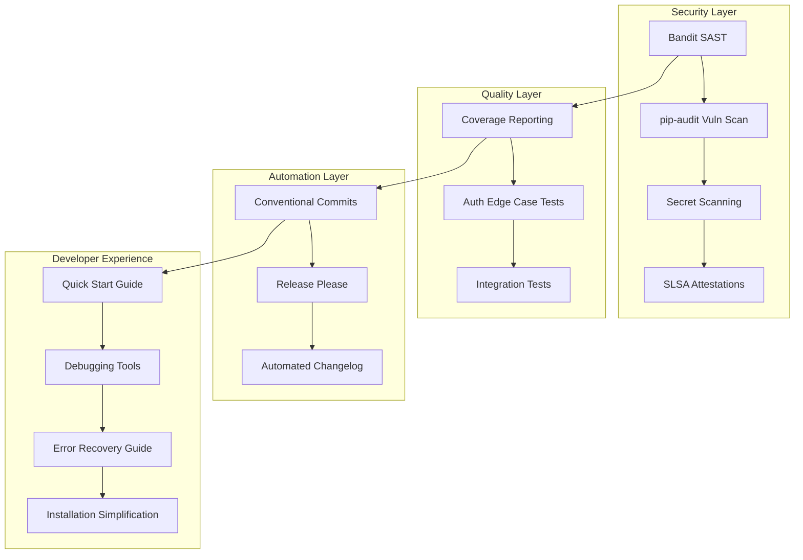

# Design Document

## Overview

This design addresses critical GA readiness improvements for the Pulse SDK by implementing comprehensive security scanning, automated release management, enhanced testing coverage, and improved developer experience. The solution builds upon the existing CI/CD infrastructure while adding enterprise-grade security and quality assurance capabilities.

The design follows a layered approach:
1. **Security Layer**: SAST, dependency scanning, and supply chain security
2. **Quality Layer**: Coverage reporting and comprehensive auth testing  
3. **Automation Layer**: Changelog generation and release management
4. **Developer Experience Layer**: Streamlined onboarding and debugging tools

## Architecture

### Current State Analysis

The project already has solid foundations:
- ✅ OIDC publishing with attestations enabled (`pypa/gh-action-pypi-publish@v1.12.4`)
- ✅ Basic CI pipeline with testing, formatting, and linting
- ✅ Pre-commit hooks configured
- ✅ Comprehensive test suite with pytest-vcr
- ✅ Multi-layer SDK architecture (Core, Analysis, DSL, Starters)

### Target Architecture



## Components and Interfaces

### 1. Security Scanning Component

**Bandit Integration**
- **Purpose**: Static Application Security Testing (SAST)
- **Configuration**: `pyproject.toml` with custom rules
- **Integration**: GitHub Actions + pre-commit hooks
- **Output**: SARIF format for GitHub Security tab

**pip-audit Integration**  
- **Purpose**: Dependency vulnerability scanning
- **Configuration**: Requirements-based scanning with auto-fix capability
- **Integration**: GitHub Actions with failure on critical vulnerabilities
- **Output**: JSON format with fix recommendations

**Secret Scanning**
- **Purpose**: Detect committed secrets and credentials
- **Tool**: GitHub native secret scanning + custom patterns
- **Integration**: Branch protection rules
- **Output**: Security alerts with remediation guidance

### 2. Coverage Reporting Component

**pytest-cov Integration**
- **Purpose**: Line and branch coverage measurement
- **Target**: 90% minimum coverage threshold
- **Integration**: CI pipeline with PR comments
- **Output**: HTML reports + coverage badges

**Coverage Enforcement**
- **Mechanism**: CI pipeline failure on coverage drop
- **Reporting**: Detailed uncovered line identification
- **Integration**: GitHub PR status checks

### 3. Authentication Testing Component

**Edge Case Test Suite**
- **Scenarios**: Token expiry, invalid credentials, network failures
- **Framework**: pytest with comprehensive mocking
- **Coverage**: Both Client Credentials and PKCE flows
- **Integration**: Existing pytest-vcr infrastructure

### 4. Release Automation Component

**Release Please Integration**
- **Purpose**: Automated changelog and version management
- **Trigger**: Conventional commit messages
- **Output**: Release PRs with generated changelogs
- **Integration**: Existing PyPI publishing workflow

**Conventional Commits**
- **Format**: `type(scope): description`
- **Types**: feat, fix, docs, style, refactor, test, chore
- **Breaking Changes**: `!` suffix or `BREAKING CHANGE:` footer
- **Validation**: Pre-commit hooks + CI checks

### 5. Documentation Enhancement Component

**Quick Start Guide**
- **Location**: `docs/quickstart.md`
- **Content**: 5-minute setup to first API call
- **Integration**: Prominent linking from main docs
- **Testing**: Automated validation of code examples

**Troubleshooting Guide**
- **Location**: `docs/troubleshooting.md`
- **Content**: Common errors with specific solutions
- **Structure**: Error code → diagnosis → resolution
- **Maintenance**: Automated updates from error patterns

### 6. Debugging Tools Component

**Debug Mode Implementation**
- **Activation**: Environment variable `PULSE_DEBUG=true`
- **Features**: Request/response logging, timing, cache stats
- **Security**: Credential masking in logs
- **Performance**: Minimal overhead when disabled

**Introspection Utilities**
- **Location**: `pulse.debug` module
- **Features**: Token status, connection health, retry stats
- **Integration**: All SDK layers (Core, Analysis, DSL, Starters)

## Data Models

### Security Configuration Model

```python
@dataclass
class SecurityConfig:
    bandit_config: Dict[str, Any]
    pip_audit_config: Dict[str, Any]
    secret_patterns: List[str]
    severity_threshold: str = "medium"
    fail_on_vulnerability: bool = True
```

### Coverage Configuration Model

```python
@dataclass
class CoverageConfig:
    minimum_coverage: float = 90.0
    fail_below_threshold: bool = True
    exclude_patterns: List[str]
    report_formats: List[str] = field(default_factory=lambda: ["html", "json"])
```

### Debug Configuration Model

```python
@dataclass
class DebugConfig:
    enabled: bool = False
    log_requests: bool = True
    log_responses: bool = True
    mask_credentials: bool = True
    timing_enabled: bool = True
    cache_stats: bool = True
```

## Error Handling

### Security Scan Failures

**Bandit Failures**
- **Critical Issues**: Block CI pipeline
- **Medium Issues**: Warning with manual review option
- **Low Issues**: Informational only
- **False Positives**: Configuration-based exclusions

**Vulnerability Scan Failures**
- **Critical/High**: Immediate CI failure
- **Medium**: Warning with auto-fix attempt
- **Low**: Informational with monitoring
- **No Fix Available**: Issue creation with tracking

### Coverage Failures

**Below Threshold**
- **Action**: CI failure with detailed report
- **Information**: Specific uncovered lines and functions
- **Guidance**: Suggestions for test improvements
- **Override**: Manual approval process for exceptional cases

### Authentication Test Failures

**Network Simulation**
- **Timeout Scenarios**: Configurable timeout testing
- **Connection Failures**: Retry logic validation
- **Rate Limiting**: Backoff strategy testing
- **Token Refresh**: Automatic renewal testing

## Testing Strategy

### Security Testing

**SAST Testing**
- **Tool**: Bandit with custom configuration
- **Scope**: All Python code including tests
- **Exclusions**: Test fixtures with known patterns
- **Reporting**: SARIF format for GitHub integration

**Dependency Testing**
- **Tool**: pip-audit with safety database
- **Scope**: All dependencies including dev dependencies
- **Frequency**: Every CI run + scheduled weekly scans
- **Auto-fix**: Enabled for non-breaking updates

### Coverage Testing

**Unit Test Coverage**
- **Target**: 90% line coverage, 85% branch coverage
- **Measurement**: pytest-cov with detailed reporting
- **Exclusions**: Test files, example scripts
- **Enforcement**: CI pipeline failure below threshold

**Integration Test Coverage**
- **Focus**: Cross-layer interactions
- **Scenarios**: End-to-end workflows
- **Authentication**: All auth flows with edge cases
- **Error Handling**: Comprehensive failure scenarios

### Authentication Edge Case Testing

**Token Lifecycle Testing**
```python
class AuthEdgeCaseTests:
    def test_expired_token_refresh(self):
        """Test automatic token refresh on expiry"""
        
    def test_invalid_credentials_handling(self):
        """Test graceful handling of invalid credentials"""
        
    def test_network_failure_during_auth(self):
        """Test auth resilience to network issues"""
        
    def test_rate_limited_auth_requests(self):
        """Test backoff strategy for rate-limited auth"""
```

### Documentation Testing

**Code Example Validation**
- **Tool**: doctest + custom validation
- **Scope**: All documentation code examples
- **Frequency**: Every documentation update
- **Environment**: Isolated test environment

**Link Validation**
- **Tool**: linkchecker or similar
- **Scope**: All documentation links
- **Frequency**: Weekly scheduled runs
- **Reporting**: Broken link identification and tracking

## Implementation Phases

### Phase 1: Security Foundation (Week 1)
1. Implement Bandit SAST scanning
2. Add pip-audit vulnerability scanning  
3. Configure secret scanning patterns
4. Update CI pipeline with security checks

### Phase 2: Quality Assurance (Week 1-2)
1. Implement coverage reporting with pytest-cov
2. Add comprehensive auth edge case tests
3. Configure coverage thresholds and enforcement
4. Enhance integration test suite

### Phase 3: Release Automation (Week 2)
1. Implement Release Please for changelog automation
2. Configure conventional commit validation
3. Update publishing workflow with enhanced attestations
4. Add SBOM generation

### Phase 4: Developer Experience (Week 2-3)
1. Create comprehensive quick start guide
2. Implement debugging tools and introspection
3. Build troubleshooting guide with common solutions
4. Simplify installation documentation

### Phase 5: Documentation & Polish (Week 3)
1. Update all documentation with new features
2. Add comprehensive error recovery guidance
3. Implement automated documentation testing
4. Final integration testing and validation

## Configuration Files

### Enhanced pyproject.toml
```toml
[tool.bandit]
exclude_dirs = ["tests", "examples", "docs"]
skips = ["B101"]  # Skip assert_used test in test files

[tool.coverage.run]
source = ["pulse"]
omit = ["tests/*", "examples/*"]

[tool.coverage.report]
fail_under = 90
show_missing = true
skip_covered = false

[tool.coverage.html]
directory = "htmlcov"

[tool.pytest.ini_options]
addopts = "--cov=pulse --cov-report=html --cov-report=json --cov-fail-under=90"
```

### GitHub Actions Workflow Updates
```yaml
# Enhanced CI with security and coverage
- name: Security Scan with Bandit
  run: bandit -r pulse -f sarif -o bandit-report.sarif

- name: Vulnerability Scan
  run: pip-audit --format=json --output=vuln-report.json

- name: Coverage Report
  run: pytest --cov=pulse --cov-report=json

- name: Upload Coverage to PR
  uses: orgoro/coverage@v3
  with:
    coverageFile: coverage.json
```

This design provides a comprehensive foundation for implementing all the GA readiness improvements while maintaining the existing architecture and development workflow.