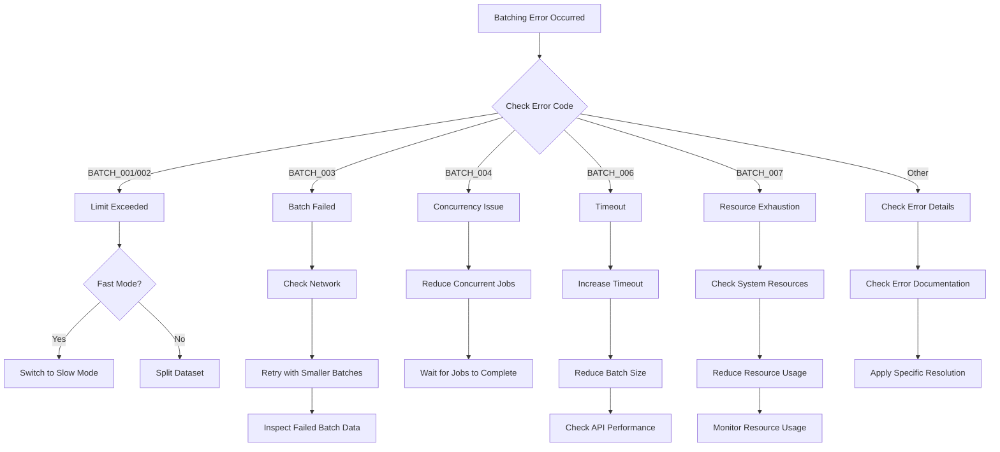
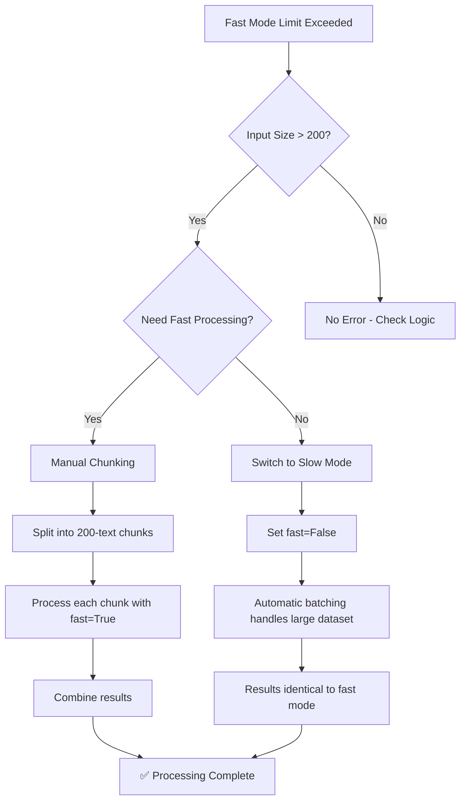
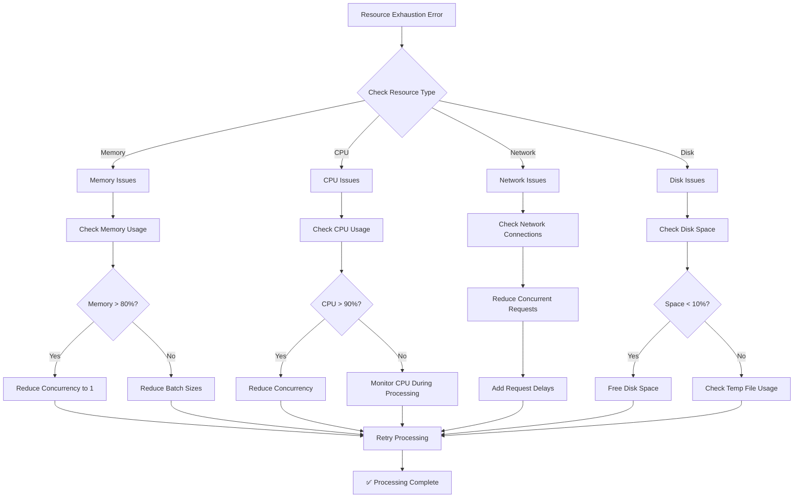
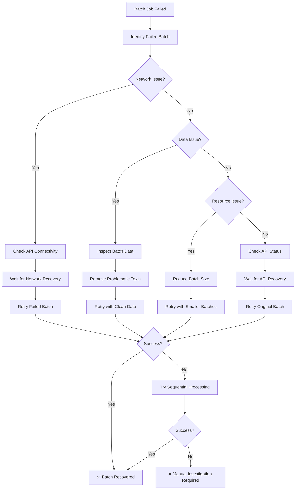

# Batching Error Reference Guide

This comprehensive guide covers all batching-related errors in the Pulse SDK, providing detailed resolution steps, code examples, and troubleshooting guidance for large-scale data processing operations.

## Quick Reference

| Error Code | Category | Severity | Description | Quick Fix |
|------------|----------|----------|-------------|-----------|
| [BATCH_001](#batch_001) | Limit Exceeded | User Error | Fast mode limit exceeded | Use `fast=False` |
| [BATCH_002](#batch_002) | Limit Exceeded | User Error | Slow mode limit exceeded | Split dataset |
| [BATCH_003](#batch_003) | Batch Failed | Runtime Error | Individual batch failed | Retry with smaller batches |
| [BATCH_004](#batch_004) | Concurrency | Config Error | Too many concurrent jobs | Reduce concurrency |
| [BATCH_005](#batch_005) | Informational | Info | Auto-batching triggered | No action needed |
| [BATCH_006](#batch_006) | Timeout | Runtime Error | Batch operation timeout | Increase timeout |
| [BATCH_007](#batch_007) | Resource | System Error | Resource exhaustion | Reduce resource usage |
| [BATCH_008](#batch_008) | Data Integrity | Critical | Result order corruption | Report bug |
| [BATCH_009](#batch_009) | Configuration | User Error | Invalid batch config | Fix configuration |
| [BATCH_010](#batch_010) | Data Processing | Runtime Error | Result aggregation failed | Check batch results |

## Error Categories

### Limit Exceeded Errors
Errors that occur when input data exceeds processing limits.

### Batch Processing Errors
Errors that occur during batch execution and processing.

### Configuration Errors
Errors related to invalid batching configuration.

### System Resource Errors
Errors related to system resource constraints.

## Detailed Error Reference
## BATCH_001: Fast Mode Limit Exceeded {#batch_001}

**Error Code:** `BATCH_001`
**Category:** Limit Exceeded
**Severity:** User Error
**Retryable:** No (requires user action)

### Description
Fast mode processing has strict limits to ensure quick response times. This error occurs when you attempt to process more texts than the fast mode limit allows.

### Error Message
```
Fast mode supports up to {limit} texts. Use slow mode for larger datasets or reduce input size.
```

### Limits by Feature
| Feature | Fast Mode Limit |
|---------|----------------|
| Sentiment Analysis | 200 texts |
| Embeddings | 200 texts |
| Element Extraction | 200 texts |

### Resolution Steps

#### Primary Solution: Switch to Slow Mode
```python
# Instead of this (will fail with >200 texts):
result = client.analyze_sentiment(large_text_list, fast=True)

# Use this:
result = client.analyze_sentiment(large_text_list, fast=False)
```

#### Alternative Solution: Reduce Input Size
```python
# Process only the first 200 texts
limited_texts = texts[:200]
result = client.analyze_sentiment(limited_texts, fast=True)
```

#### Manual Chunking (if you need fast mode)
```python
def process_in_fast_chunks(texts, chunk_size=200):
    results = []
    for i in range(0, len(texts), chunk_size):
        chunk = texts[i:i + chunk_size]
        result = client.analyze_sentiment(chunk, fast=True)
        results.extend(result.sentiments)
    return results

# Usage
all_results = process_in_fast_chunks(large_text_list)
```

### Code Examples by Feature

#### Sentiment Analysis
```python
from pulse.core.client import CoreClient
from pulse.core.exceptions import BatchingError

client = CoreClient.with_client_credentials()
texts = ["text"] * 500  # 500 texts - exceeds fast mode limit

try:
    # This will fail
    result = client.analyze_sentiment(texts, fast=True)
except BatchingError as e:
    if e.error_code == "BATCH_001":
        print(f"Fast mode limit exceeded: {e.input_count} > {e.limit}")
        print("Switching to slow mode...")

        # Switch to slow mode (automatic batching)
        result = client.analyze_sentiment(texts, fast=False)
        print(f"Successfully processed {len(result.sentiments)} sentiments")
```

#### Embeddings
```python
from pulse.core.models import EmbeddingsRequest

texts = ["text"] * 300  # Exceeds fast mode limit

try:
    request = EmbeddingsRequest(inputs=texts, fast=True)
    result = client.create_embeddings(request)
except BatchingError as e:
    if e.error_code == "BATCH_001":
        # Switch to slow mode
        request = EmbeddingsRequest(inputs=texts, fast=False)
        result = client.create_embeddings(request)
```

#### Element Extraction
```python
texts = ["text"] * 250  # Exceeds fast mode limit
dictionary = ["entity1", "entity2"]

try:
    result = client.extract_elements(texts, dictionary, fast=True)
except BatchingError as e:
    if e.error_code == "BATCH_001":
        # Switch to slow mode
        result = client.extract_elements(texts, dictionary, fast=False)
```

### Troubleshooting

#### Check Input Size
```python
print(f"Input size: {len(texts)}")
print(f"Fast mode limit: 200")
print(f"Exceeds limit: {len(texts) > 200}")
```

#### Validate Error Details
```python
try:
    result = client.analyze_sentiment(texts, fast=True)
except BatchingError as e:
    error_info = e.get_structured_info()
    print(f"Error code: {error_info['error_code']}")
    print(f"Feature: {error_info['feature']}")
    print(f"Input count: {error_info['input_count']}")
    print(f"Limit: {error_info['limit']}")
    print(f"Suggested action: {error_info['suggested_action']}")
```

### Related Errors
- [BATCH_002](#batch_002): Slow mode limit exceeded#
# BATCH_002: Slow Mode Limit Exceeded {#batch_002}

**Error Code:** `BATCH_002`
**Category:** Limit Exceeded
**Severity:** User Error
**Retryable:** No (requires data reduction)

### Description
Slow mode has maximum limits to prevent excessive resource usage. This error occurs when your dataset exceeds the maximum processing capacity.

### Error Message
```
Maximum input limit is {limit:,} texts. Please reduce your dataset size.
```

### Limits by Feature
| Feature | Slow Mode Limit |
|---------|----------------|
| Sentiment Analysis | 1,000,000 texts |
| Embeddings | 1,000,000 texts |
| Element Extraction | 1,000,000 texts |
| Clustering | 44,721 texts |

### Resolution Steps

#### Primary Solution: Split Dataset
```python
def process_large_dataset(texts, chunk_size=1_000_000):
    """Process dataset in chunks within limits."""
    all_results = []

    for i in range(0, len(texts), chunk_size):
        chunk = texts[i:i + chunk_size]
        print(f"Processing chunk {i//chunk_size + 1}: {len(chunk)} texts")

        result = client.analyze_sentiment(chunk, fast=False)
        all_results.extend(result.sentiments)

    return all_results

# Usage with 2 million texts
huge_dataset = ["text"] * 2_000_000
results = process_large_dataset(huge_dataset)
```

#### Alternative: Data Sampling
```python
import random

# Sample 1 million texts from larger dataset
if len(texts) > 1_000_000:
    sampled_texts = random.sample(texts, 1_000_000)
    result = client.analyze_sentiment(sampled_texts, fast=False)
```

#### Alternative: Data Filtering
```python
# Filter texts by length or other criteria
filtered_texts = [text for text in texts if len(text) > 10 and len(text) < 1000]

if len(filtered_texts) <= 1_000_000:
    result = client.analyze_sentiment(filtered_texts, fast=False)
else:
    # Still too many, take first 1M
    result = client.analyze_sentiment(filtered_texts[:1_000_000], fast=False)
```

### Code Examples

#### Handling Large Sentiment Analysis
```python
from pulse.core.exceptions import BatchingError

def robust_sentiment_analysis(texts):
    """Handle sentiment analysis with automatic chunking."""
    try:
        return client.analyze_sentiment(texts, fast=False)
    except BatchingError as e:
        if e.error_code == "BATCH_002":
            print(f"Dataset too large: {e.input_count:,} > {e.limit:,}")

            # Process in chunks
            chunk_size = e.limit
            results = []

            for i in range(0, len(texts), chunk_size):
                chunk = texts[i:i + chunk_size]
                chunk_result = client.analyze_sentiment(chunk, fast=False)
                results.extend(chunk_result.sentiments)

            # Create combined response
            from pulse.core.models import SentimentResponse
            return SentimentResponse(
                sentiments=results,
                usage={"total_texts": len(texts)}
            )
        else:
            raise

# Usage
massive_texts = ["text"] * 1_500_000
result = robust_sentiment_analysis(massive_texts)
```

#### Handling Large Embeddings
```python
def process_embeddings_in_chunks(texts, max_chunk_size=1_000_000):
    """Process embeddings in manageable chunks."""
    all_embeddings = []

    for i in range(0, len(texts), max_chunk_size):
        chunk = texts[i:i + max_chunk_size]

        try:
            from pulse.core.models import EmbeddingsRequest
            request = EmbeddingsRequest(inputs=chunk, fast=False)
            result = client.create_embeddings(request)
            all_embeddings.extend(result.embeddings)

        except BatchingError as e:
            if e.error_code == "BATCH_002":
                # Chunk is still too large, split further
                smaller_chunks = [chunk[j:j+500_000] for j in range(0, len(chunk), 500_000)]
                for small_chunk in smaller_chunks:
                    request = EmbeddingsRequest(inputs=small_chunk, fast=False)
                    result = client.create_embeddings(request)
                    all_embeddings.extend(result.embeddings)

    return all_embeddings
```

### Troubleshooting

#### Calculate Required Chunks
```python
def calculate_chunks_needed(total_texts, limit=1_000_000):
    """Calculate how many chunks are needed."""
    chunks_needed = (total_texts + limit - 1) // limit  # Ceiling division
    print(f"Total texts: {total_texts:,}")
    print(f"Limit per chunk: {limit:,}")
    print(f"Chunks needed: {chunks_needed}")
    print(f"Estimated processing time: {chunks_needed * 5} minutes")
    return chunks_needed

# Usage
calculate_chunks_needed(2_500_000)
```

#### Monitor Progress
```python
from tqdm import tqdm

def process_with_progress(texts, chunk_size=1_000_000):
    """Process with progress bar."""
    chunks = [texts[i:i + chunk_size] for i in range(0, len(texts), chunk_size)]
    results = []

    for chunk in tqdm(chunks, desc="Processing chunks"):
        result = client.analyze_sentiment(chunk, fast=False)
        results.extend(result.sentiments)

    return results
```

### Performance Optimization

#### Optimal Chunk Sizes
```python
# Recommended chunk sizes for different features
OPTIMAL_CHUNK_SIZES = {
    "sentiment": 500_000,    # Balance speed and memory
    "embeddings": 200_000,   # Embeddings use more memory
    "extractions": 300_000,  # Moderate memory usage
    "clustering": 10_000,    # Complex processing
}

def get_optimal_chunk_size(feature_name, total_texts):
    """Get optimal chunk size for feature."""
    base_size = OPTIMAL_CHUNK_SIZES.get(feature_name, 500_000)

    # Adjust based on total size
    if total_texts < base_size:
        return total_texts
    elif total_texts > 5_000_000:
        return base_size // 2  # Smaller chunks for very large datasets
    else:
        return base_size
```

### Related Errors
- [BATCH_001](#batch_001): Fast mode limit exceeded
- [BATCH_003](#batch_003): Individual batch failures during chunked processing## BA
TCH_003: Batch Job Failed {#batch_003}

**Error Code:** `BATCH_003`
**Category:** Batch Failed
**Severity:** Runtime Error
**Retryable:** Yes (with modifications)

### Description
This error occurs when an individual batch within a larger batched operation fails. The failure could be due to network issues, API errors, or problematic data in the specific batch.

### Error Message
```
Batch {batch_num} of {total_batches} failed: {error_message}
```

### Common Causes
- Network connectivity issues during batch processing
- API rate limiting or temporary service unavailability
- Problematic input data in specific batch
- Memory or resource constraints
- Timeout during batch processing

### Resolution Steps

#### Primary Solution: Retry with Smaller Batches
```python
from pulse.core.exceptions import BatchingError
import time

def retry_failed_batch(texts, original_batch_size=2000, max_retries=3):
    """Retry processing with progressively smaller batch sizes."""

    batch_size = original_batch_size

    for attempt in range(max_retries):
        try:
            # Try processing with current batch size
            result = client.analyze_sentiment(texts, fast=False)
            return result

        except BatchingError as e:
            if e.error_code == "BATCH_003":
                print(f"Batch {e.batch_number} failed: {e.context.get('error_message')}")

                # Reduce batch size for retry
                batch_size = batch_size // 2
                print(f"Retrying with smaller batch size: {batch_size}")

                # Wait before retry
                time.sleep(2 ** attempt)

                # Configure smaller batch size (if supported by client)
                # This would require client configuration support
                continue
            else:
                raise

    raise Exception(f"Failed after {max_retries} attempts")
```

#### Alternative: Process Individual Batches
```python
def process_with_individual_batch_handling(texts, batch_size=2000):
    """Process batches individually with error handling."""

    batches = [texts[i:i + batch_size] for i in range(0, len(texts), batch_size)]
    successful_results = []
    failed_batches = []

    for batch_num, batch in enumerate(batches, 1):
        try:
            print(f"Processing batch {batch_num}/{len(batches)}")
            result = client.analyze_sentiment(batch, fast=False)
            successful_results.extend(result.sentiments)

        except Exception as e:
            print(f"Batch {batch_num} failed: {e}")
            failed_batches.append({
                'batch_num': batch_num,
                'batch_data': batch,
                'error': str(e)
            })

    # Retry failed batches with smaller size
    for failed_batch in failed_batches:
        try:
            smaller_batches = [
                failed_batch['batch_data'][i:i + 500]
                for i in range(0, len(failed_batch['batch_data']), 500)
            ]

            for small_batch in smaller_batches:
                result = client.analyze_sentiment(small_batch, fast=False)
                successful_results.extend(result.sentiments)

        except Exception as e:
            print(f"Failed to recover batch {failed_batch['batch_num']}: {e}")

    return successful_results
```

### Code Examples

#### Robust Batch Processing with Recovery
```python
import logging
from typing import List, Any

logging.basicConfig(level=logging.INFO)
logger = logging.getLogger(__name__)

class BatchProcessor:
    def __init__(self, client, initial_batch_size=2000, min_batch_size=100):
        self.client = client
        self.initial_batch_size = initial_batch_size
        self.min_batch_size = min_batch_size

    def process_with_recovery(self, texts: List[str], feature: str = "sentiment") -> List[Any]:
        """Process texts with automatic batch failure recovery."""

        try:
            # Try normal processing first
            if feature == "sentiment":
                result = self.client.analyze_sentiment(texts, fast=False)
                return result.sentiments
            elif feature == "embeddings":
                from pulse.core.models import EmbeddingsRequest
                request = EmbeddingsRequest(inputs=texts, fast=False)
                result = self.client.create_embeddings(request)
                return result.embeddings

        except BatchingError as e:
            if e.error_code == "BATCH_003":
                logger.warning(f"Batch processing failed: {e}")
                return self._recover_from_batch_failure(texts, feature, e)
            else:
                raise

    def _recover_from_batch_failure(self, texts: List[str], feature: str, error: BatchingError) -> List[Any]:
        """Recover from batch failure by processing smaller chunks."""

        failed_batch_num = error.batch_number
        total_batches = error.total_batches

        logger.info(f"Recovering from batch {failed_batch_num}/{total_batches} failure")

        # Calculate smaller batch size
        current_batch_size = len(texts) // total_batches if total_batches else self.initial_batch_size
        new_batch_size = max(current_batch_size // 2, self.min_batch_size)

        logger.info(f"Reducing batch size from {current_batch_size} to {new_batch_size}")

        # Process in smaller batches
        results = []
        batches = [texts[i:i + new_batch_size] for i in range(0, len(texts), new_batch_size)]

        for batch_num, batch in enumerate(batches, 1):
            try:
                if feature == "sentiment":
                    result = self.client.analyze_sentiment(batch, fast=False)
                    results.extend(result.sentiments)
                elif feature == "embeddings":
                    from pulse.core.models import EmbeddingsRequest
                    request = EmbeddingsRequest(inputs=batch, fast=False)
                    result = self.client.create_embeddings(request)
                    results.extend(result.embeddings)

                logger.info(f"Successfully processed recovery batch {batch_num}/{len(batches)}")

            except Exception as batch_error:
                logger.error(f"Recovery batch {batch_num} also failed: {batch_error}")

                # Try even smaller batches for this specific batch
                mini_batches = [batch[i:i + self.min_batch_size] for i in range(0, len(batch), self.min_batch_size)]

                for mini_batch in mini_batches:
                    try:
                        if feature == "sentiment":
                            result = self.client.analyze_sentiment(mini_batch, fast=False)
                            results.extend(result.sentiments)
                        elif feature == "embeddings":
                            from pulse.core.models import EmbeddingsRequest
                            request = EmbeddingsRequest(inputs=mini_batch, fast=False)
                            result = self.client.create_embeddings(request)
                            results.extend(result.embeddings)
                    except Exception as mini_error:
                        logger.error(f"Mini batch also failed: {mini_error}")
                        # Skip this mini batch
                        continue

        return results

# Usage
processor = BatchProcessor(client)
texts = ["text"] * 10000

try:
    results = processor.process_with_recovery(texts, "sentiment")
    print(f"Successfully processed {len(results)} texts")
except Exception as e:
    print(f"Processing failed completely: {e}")
```

#### Inspect Failed Batch Data
```python
def inspect_failed_batch(error: BatchingError, original_texts: List[str]):
    """Inspect the data in a failed batch to identify issues."""

    if not error.batch_number or not error.total_batches:
        print("No batch information available")
        return

    # Calculate batch boundaries
    total_texts = len(original_texts)
    batch_size = total_texts // error.total_batches

    start_idx = (error.batch_number - 1) * batch_size
    end_idx = start_idx + batch_size

    failed_batch_data = original_texts[start_idx:end_idx]

    print(f"Failed batch {error.batch_number} analysis:")
    print(f"  Batch size: {len(failed_batch_data)}")
    print(f"  Text length range: {min(len(t) for t in failed_batch_data)} - {max(len(t) for t in failed_batch_data)}")
    print(f"  Average text length: {sum(len(t) for t in failed_batch_data) / len(failed_batch_data):.1f}")

    # Check for problematic texts
    empty_texts = [i for i, text in enumerate(failed_batch_data) if not text.strip()]
    very_long_texts = [i for i, text in enumerate(failed_batch_data) if len(text) > 10000]

    if empty_texts:
        print(f"  Found {len(empty_texts)} empty texts at indices: {empty_texts[:5]}")

    if very_long_texts:
        print(f"  Found {len(very_long_texts)} very long texts (>10k chars) at indices: {very_long_texts[:5]}")

    # Sample some texts for manual inspection
    print(f"  Sample texts:")
    for i, text in enumerate(failed_batch_data[:3]):
        print(f"    [{i}]: {text[:100]}...")
```

### Troubleshooting

#### Check Network Connectivity
```python
import httpx
import time

def check_api_connectivity():
    """Check if API is reachable and responsive."""
    try:
        response = httpx.get("https://pulse.researchwiseai.com/v1/health", timeout=10)
        print(f"API health check: {response.status_code}")
        return response.status_code == 200
    except Exception as e:
        print(f"API connectivity issue: {e}")
        return False

def wait_for_api_recovery(max_wait=300):
    """Wait for API to recover from issues."""
    start_time = time.time()

    while time.time() - start_time < max_wait:
        if check_api_connectivity():
            print("API is responsive")
            return True

        print("API not responsive, waiting 30 seconds...")
        time.sleep(30)

    print("API did not recover within timeout")
    return False
```

#### Monitor Batch Processing
```python
def process_with_monitoring(texts, batch_size=2000):
    """Process with detailed monitoring and logging."""

    batches = [texts[i:i + batch_size] for i in range(0, len(texts), batch_size)]
    results = []
    failed_batches = []

    start_time = time.time()

    for batch_num, batch in enumerate(batches, 1):
        batch_start = time.time()

        try:
            result = client.analyze_sentiment(batch, fast=False)
            batch_time = time.time() - batch_start

            results.extend(result.sentiments)

            print(f"Batch {batch_num}/{len(batches)} completed in {batch_time:.1f}s")

        except BatchingError as e:
            batch_time = time.time() - batch_start

            print(f"Batch {batch_num}/{len(batches)} failed after {batch_time:.1f}s: {e}")
            failed_batches.append({
                'batch_num': batch_num,
                'error': str(e),
                'batch_size': len(batch),
                'processing_time': batch_time
            })

    total_time = time.time() - start_time

    print(f"\nProcessing Summary:")
    print(f"  Total time: {total_time:.1f}s")
    print(f"  Successful batches: {len(batches) - len(failed_batches)}/{len(batches)}")
    print(f"  Failed batches: {len(failed_batches)}")
    print(f"  Success rate: {((len(batches) - len(failed_batches)) / len(batches) * 100):.1f}%")

    return results, failed_batches
```

### Related Errors
- [BATCH_006](#batch_006): Batch timeout errors
- [BATCH_007](#batch_007): Resource exhaustion during batch processing
- [BATCH_010](#batch_010): Result aggregation failures#
# BATCH_004: Concurrency Limit Exceeded {#batch_004}

**Error Code:** `BATCH_004`
**Category:** Concurrency Error
**Severity:** Configuration Error
**Retryable:** Yes (with configuration changes)

### Description
This error occurs when the number of concurrent batch jobs exceeds the configured limit. The SDK limits concurrent jobs to prevent overwhelming the API and system resources.

### Error Message
```
Too many concurrent jobs: {current_jobs}. Maximum allowed: {max_jobs}
```

### Default Limits
- **Maximum concurrent jobs:** 5
- **Configurable range:** 1-10 jobs
- **Recommended for most systems:** 3-5 jobs

### Resolution Steps

#### Primary Solution: Reduce Concurrent Jobs
```python
from pulse.core.concurrent import BatchingConfig
from pulse.core.client import CoreClient

# Configure lower concurrency
config = BatchingConfig(max_concurrent_jobs=3)
client = CoreClient.with_client_credentials(batching_config=config)

# Now process large datasets
texts = ["text"] * 50000
result = client.analyze_sentiment(texts, fast=False)
```

#### Alternative: Sequential Processing
```python
# Force sequential processing (1 job at a time)
config = BatchingConfig(max_concurrent_jobs=1)
client = CoreClient.with_client_credentials(batching_config=config)

# This will process batches one at a time
result = client.analyze_sentiment(texts, fast=False)
```

#### Alternative: Wait for Jobs to Complete
```python
import time
from pulse.core.exceptions import BatchingError

def process_with_job_management(texts, max_retries=3):
    """Process with automatic job management."""

    for attempt in range(max_retries):
        try:
            result = client.analyze_sentiment(texts, fast=False)
            return result

        except BatchingError as e:
            if e.error_code == "BATCH_004":
                current_jobs = e.context.get('current_jobs', 0)
                max_jobs = e.context.get('max_jobs', 5)

                print(f"Too many concurrent jobs ({current_jobs}/{max_jobs})")
                print(f"Waiting for jobs to complete... (attempt {attempt + 1}/{max_retries})")

                # Wait for some jobs to complete
                wait_time = 30 * (attempt + 1)  # Increasing wait time
                time.sleep(wait_time)

                continue
            else:
                raise

    raise Exception(f"Failed to process after {max_retries} attempts due to concurrency limits")
```

### Code Examples

#### Dynamic Concurrency Configuration
```python
import psutil
from pulse.core.concurrent import BatchingConfig

def get_optimal_concurrency():
    """Calculate optimal concurrency based on system resources."""

    # Get system info
    cpu_count = psutil.cpu_count()
    memory_gb = psutil.virtual_memory().total / (1024**3)

    # Conservative concurrency calculation
    if memory_gb < 4:
        return 1  # Low memory systems
    elif memory_gb < 8:
        return 2  # Medium memory systems
    elif cpu_count < 4:
        return 3  # Low CPU systems
    else:
        return min(5, cpu_count // 2)  # High-end systems

# Configure based on system capabilities
optimal_concurrency = get_optimal_concurrency()
config = BatchingConfig(max_concurrent_jobs=optimal_concurrency)
client = CoreClient.with_client_credentials(batching_config=config)

print(f"Using {optimal_concurrency} concurrent jobs based on system resources")
```

#### Adaptive Concurrency Management
```python
class AdaptiveBatchProcessor:
    def __init__(self, client, initial_concurrency=5):
        self.client = client
        self.current_concurrency = initial_concurrency
        self.min_concurrency = 1
        self.max_concurrency = 10

    def process_with_adaptive_concurrency(self, texts, feature="sentiment"):
        """Process with adaptive concurrency management."""

        while self.current_concurrency >= self.min_concurrency:
            try:
                # Configure client with current concurrency
                config = BatchingConfig(max_concurrent_jobs=self.current_concurrency)
                self.client._batching_config = config

                print(f"Attempting processing with {self.current_concurrency} concurrent jobs")

                if feature == "sentiment":
                    result = self.client.analyze_sentiment(texts, fast=False)
                    return result
                elif feature == "embeddings":
                    from pulse.core.models import EmbeddingsRequest
                    request = EmbeddingsRequest(inputs=texts, fast=False)
                    result = self.client.create_embeddings(request)
                    return result

            except BatchingError as e:
                if e.error_code == "BATCH_004":
                    # Reduce concurrency and retry
                    self.current_concurrency = max(1, self.current_concurrency - 1)
                    print(f"Reducing concurrency to {self.current_concurrency}")
                    continue
                else:
                    raise

        raise Exception("Could not process even with minimum concurrency")

# Usage
processor = AdaptiveBatchProcessor(client)
texts = ["text"] * 100000

try:
    result = processor.process_with_adaptive_concurrency(texts, "sentiment")
    print(f"Successfully processed with {processor.current_concurrency} concurrent jobs")
except Exception as e:
    print(f"Processing failed: {e}")
```

#### Monitor Concurrent Job Usage
```python
import threading
import time
from collections import defaultdict

class ConcurrencyMonitor:
    def __init__(self):
        self.active_jobs = defaultdict(int)
        self.job_history = []
        self.lock = threading.Lock()

    def start_job(self, job_type):
        """Record job start."""
        with self.lock:
            self.active_jobs[job_type] += 1
            self.job_history.append({
                'timestamp': time.time(),
                'action': 'start',
                'job_type': job_type,
                'active_count': self.active_jobs[job_type]
            })

    def end_job(self, job_type):
        """Record job end."""
        with self.lock:
            self.active_jobs[job_type] = max(0, self.active_jobs[job_type] - 1)
            self.job_history.append({
                'timestamp': time.time(),
                'action': 'end',
                'job_type': job_type,
                'active_count': self.active_jobs[job_type]
            })

    def get_current_usage(self):
        """Get current job usage."""
        with self.lock:
            return dict(self.active_jobs)

    def get_peak_usage(self, window_seconds=300):
        """Get peak usage in time window."""
        cutoff_time = time.time() - window_seconds

        with self.lock:
            recent_history = [h for h in self.job_history if h['timestamp'] > cutoff_time]

            if not recent_history:
                return {}

            peak_usage = defaultdict(int)
            for entry in recent_history:
                if entry['active_count'] > peak_usage[entry['job_type']]:
                    peak_usage[entry['job_type']] = entry['active_count']

            return dict(peak_usage)

# Global monitor instance
monitor = ConcurrencyMonitor()

def process_with_monitoring(texts):
    """Process with concurrency monitoring."""

    monitor.start_job('sentiment')

    try:
        result = client.analyze_sentiment(texts, fast=False)
        return result
    finally:
        monitor.end_job('sentiment')

# Check usage
current_usage = monitor.get_current_usage()
peak_usage = monitor.get_peak_usage()

print(f"Current concurrent jobs: {current_usage}")
print(f"Peak usage (last 5 min): {peak_usage}")
```

### Troubleshooting

#### Check Current Configuration
```python
def check_concurrency_config(client):
    """Check current concurrency configuration."""

    config = getattr(client, '_batching_config', None)

    if config:
        print(f"Max concurrent jobs: {config.max_concurrent_jobs}")
        print(f"Timeout per batch: {config.timeout_per_batch}")
        print(f"Retry failed batches: {config.retry_failed_batches}")
    else:
        print("Using default batching configuration")
        print("Default max concurrent jobs: 5")
```

#### Test Concurrency Limits
```python
import concurrent.futures
import time

def test_concurrency_limit(max_jobs=5):
    """Test actual concurrency limits."""

    def dummy_job(job_id):
        """Simulate a batch job."""
        print(f"Job {job_id} started")
        time.sleep(2)  # Simulate processing time
        print(f"Job {job_id} completed")
        return job_id

    # Test with ThreadPoolExecutor
    with concurrent.futures.ThreadPoolExecutor(max_workers=max_jobs) as executor:
        # Submit more jobs than the limit
        futures = [executor.submit(dummy_job, i) for i in range(max_jobs + 2)]

        # Wait for completion
        results = []
        for future in concurrent.futures.as_completed(futures):
            results.append(future.result())

    print(f"Completed {len(results)} jobs with max_workers={max_jobs}")

# Test different concurrency levels
for concurrency in [1, 3, 5, 8]:
    print(f"\nTesting concurrency: {concurrency}")
    test_concurrency_limit(concurrency)
```

#### Resource Usage Analysis
```python
import psutil
import time

def analyze_resource_usage_during_processing(texts, concurrency_levels=[1, 3, 5]):
    """Analyze resource usage at different concurrency levels."""

    results = {}

    for concurrency in concurrency_levels:
        print(f"\nTesting concurrency level: {concurrency}")

        # Configure concurrency
        config = BatchingConfig(max_concurrent_jobs=concurrency)
        client_test = CoreClient.with_client_credentials(batching_config=config)

        # Monitor resources before
        initial_memory = psutil.virtual_memory().percent
        initial_cpu = psutil.cpu_percent(interval=1)

        start_time = time.time()

        try:
            # Process subset of texts for testing
            test_texts = texts[:1000]  # Use smaller dataset for testing
            result = client_test.analyze_sentiment(test_texts, fast=False)

            processing_time = time.time() - start_time

            # Monitor resources after
            final_memory = psutil.virtual_memory().percent
            final_cpu = psutil.cpu_percent(interval=1)

            results[concurrency] = {
                'processing_time': processing_time,
                'memory_increase': final_memory - initial_memory,
                'avg_cpu': (initial_cpu + final_cpu) / 2,
                'success': True,
                'texts_processed': len(result.sentiments)
            }

            print(f"  Processing time: {processing_time:.1f}s")
            print(f"  Memory increase: {final_memory - initial_memory:.1f}%")
            print(f"  Average CPU: {(initial_cpu + final_cpu) / 2:.1f}%")

        except Exception as e:
            results[concurrency] = {
                'processing_time': time.time() - start_time,
                'error': str(e),
                'success': False
            }
            print(f"  Failed: {e}")

    # Recommend optimal concurrency
    successful_results = {k: v for k, v in results.items() if v['success']}

    if successful_results:
        # Find fastest successful configuration
        optimal = min(successful_results.items(), key=lambda x: x[1]['processing_time'])
        print(f"\nRecommended concurrency: {optimal[0]} (processing time: {optimal[1]['processing_time']:.1f}s)")

    return results
```

### Performance Considerations

#### Concurrency vs. Performance Trade-offs
```python
def benchmark_concurrency_levels(texts, levels=[1, 2, 3, 5, 8]):
    """Benchmark different concurrency levels."""

    benchmark_results = {}

    # Use subset for benchmarking
    test_texts = texts[:5000] if len(texts) > 5000 else texts

    for level in levels:
        print(f"Benchmarking concurrency level: {level}")

        config = BatchingConfig(max_concurrent_jobs=level)
        test_client = CoreClient.with_client_credentials(batching_config=config)

        start_time = time.time()

        try:
            result = test_client.analyze_sentiment(test_texts, fast=False)
            processing_time = time.time() - start_time

            benchmark_results[level] = {
                'time': processing_time,
                'throughput': len(test_texts) / processing_time,
                'success': True
            }

            print(f"  Time: {processing_time:.1f}s")
            print(f"  Throughput: {len(test_texts) / processing_time:.1f} texts/sec")

        except Exception as e:
            benchmark_results[level] = {
                'time': float('inf'),
                'error': str(e),
                'success': False
            }
            print(f"  Failed: {e}")

    # Find optimal level
    successful = {k: v for k, v in benchmark_results.items() if v['success']}
    if successful:
        optimal = max(successful.items(), key=lambda x: x[1]['throughput'])
        print(f"\nOptimal concurrency: {optimal[0]} ({optimal[1]['throughput']:.1f} texts/sec)")

    return benchmark_results
```

### Related Errors
- [BATCH_007](#batch_007): Resource exhaustion (often related to high concurrency)
- [BATCH_006](#batch_006): Timeout errors (may occur with high concurrency)#
# BATCH_005: Clustering Auto-Batch Triggered {#batch_005}

**Error Code:** `BATCH_005`
**Category:** Informational
**Severity:** Info
**Retryable:** N/A (informational only)

### Description
This is an informational message indicating that clustering automatic batching has been triggered because the input size exceeds the threshold. This is normal behavior and requires no action.

### Error Message
```
Input size {input_count} exceeds threshold {threshold}. Automatic batching enabled.
```

### Trigger Conditions
- **Clustering threshold:** 500 texts
- **Automatic batching:** Enabled for inputs > 500 texts
- **Processing method:** Intelligent parallel batching with result reconstruction

### What Happens Next
1. Input is automatically split into manageable chunks
2. Clustering is performed on each chunk in parallel
3. Results are intelligently reconstructed to match non-batched clustering
4. Final clustering assignments are returned

### Code Examples

#### Normal Clustering (No Message)
```python
# Small dataset - no auto-batching
small_texts = ["text"] * 300
result = client.cluster_texts(small_texts, algorithm="kmeans", num_clusters=5)
# Processes normally without batching
```

#### Auto-Batching Triggered
```python
# Large dataset - auto-batching triggered
large_texts = ["text"] * 2000

# This will trigger BATCH_005 informational message
result = client.cluster_texts(large_texts, algorithm="kmeans", num_clusters=10)

# Results are identical to non-batched clustering
print(f"Clustered {len(result.clusters)} texts into {len(set(result.cluster_assignments))} clusters")
```

#### Handling the Informational Message
```python
import logging
from pulse.core.exceptions import BatchingError

# Configure logging to see informational messages
logging.basicConfig(level=logging.INFO)

def cluster_with_info_handling(texts, **kwargs):
    """Cluster texts with informational message handling."""

    try:
        result = client.cluster_texts(texts, **kwargs)
        return result

    except BatchingError as e:
        if e.error_code == "BATCH_005":
            # This is just informational
            print(f"Info: {e.message}")
            print("Automatic batching will handle the large dataset")

            # Continue processing - this shouldn't actually raise an exception
            # but if it does, we can handle it gracefully
            result = client.cluster_texts(texts, **kwargs)
            return result
        else:
            raise

# Usage
texts = ["text"] * 1500
result = cluster_with_info_handling(texts, algorithm="kmeans", num_clusters=8)
```

### Performance Expectations

#### Processing Time Estimates
```python
def estimate_clustering_time(num_texts, algorithm="kmeans"):
    """Estimate clustering processing time."""

    if num_texts <= 500:
        # No batching
        base_time = num_texts * 0.01  # ~10ms per text
        return f"{base_time:.1f} seconds (no batching)"

    else:
        # With batching
        num_batches = (num_texts + 499) // 500  # Ceiling division
        batch_time = 500 * 0.01  # Time per batch
        parallel_factor = min(5, num_batches)  # Up to 5 parallel jobs

        total_time = (num_batches / parallel_factor) * batch_time
        return f"{total_time:.1f} seconds (batched across {num_batches} batches)"

# Examples
print(f"300 texts: {estimate_clustering_time(300)}")
print(f"1000 texts: {estimate_clustering_time(1000)}")
print(f"5000 texts: {estimate_clustering_time(5000)}")
```

#### Memory Usage Considerations
```python
def estimate_memory_usage(num_texts):
    """Estimate memory usage for clustering."""

    if num_texts <= 500:
        # Single clustering operation
        memory_mb = num_texts * 0.1  # ~100KB per text
        return f"{memory_mb:.1f} MB (single operation)"

    else:
        # Batched clustering
        batch_size = 500
        memory_per_batch = batch_size * 0.1
        max_concurrent = min(5, (num_texts + 499) // 500)

        total_memory = memory_per_batch * max_concurrent
        return f"{total_memory:.1f} MB (max {max_concurrent} concurrent batches)"

print(f"Memory for 300 texts: {estimate_memory_usage(300)}")
print(f"Memory for 2000 texts: {estimate_memory_usage(2000)}")
```

### Optimization Tips

#### Reduce Input Size if Needed
```python
def optimize_clustering_input(texts, max_size=1000):
    """Optimize clustering input size if processing time is a concern."""

    if len(texts) <= max_size:
        return texts, "No optimization needed"

    # Option 1: Random sampling
    import random
    sampled_texts = random.sample(texts, max_size)

    # Option 2: Take first N texts
    # truncated_texts = texts[:max_size]

    # Option 3: Filter by text length (remove very short/long texts)
    # filtered_texts = [t for t in texts if 10 <= len(t) <= 1000][:max_size]

    return sampled_texts, f"Reduced from {len(texts)} to {len(sampled_texts)} texts"

# Usage
large_dataset = ["text"] * 3000
optimized_texts, message = optimize_clustering_input(large_dataset, max_size=1500)
print(message)

result = client.cluster_texts(optimized_texts, algorithm="kmeans", num_clusters=10)
```

#### Monitor Batching Progress
```python
import time
from contextlib import contextmanager

@contextmanager
def clustering_progress_monitor():
    """Monitor clustering progress with timing."""

    start_time = time.time()
    print("Starting clustering operation...")

    try:
        yield
    finally:
        end_time = time.time()
        print(f"Clustering completed in {end_time - start_time:.1f} seconds")

# Usage
texts = ["text"] * 2000

with clustering_progress_monitor():
    result = client.cluster_texts(texts, algorithm="kmeans", num_clusters=15)

print(f"Generated {len(set(result.cluster_assignments))} clusters")
```

### Related Information
- This message indicates normal operation for large clustering datasets
- No action is required - processing will continue automatically
- Results will be identical to non-batched clustering
- Processing time may be longer but memory usage is optimized

---

## BATCH_006: Batch Timeout {#batch_006}

**Error Code:** `BATCH_006`
**Category:** Timeout Error
**Severity:** Runtime Error
**Retryable:** Yes (with configuration changes)

### Description
This error occurs when a batch operation exceeds the configured timeout duration. This can happen with large batches, slow network connections, or API performance issues.

### Error Message
```
Batch {batch_num} timed out after {timeout} seconds
```

### Default Timeouts
- **Default timeout per batch:** 300 seconds (5 minutes)
- **Configurable range:** 60-1800 seconds (1-30 minutes)
- **Recommended for large batches:** 600-900 seconds (10-15 minutes)

### Resolution Steps

#### Primary Solution: Increase Timeout
```python
from pulse.core.concurrent import BatchingConfig

# Increase timeout for large batches
config = BatchingConfig(
    timeout_per_batch=600.0,  # 10 minutes per batch
    max_concurrent_jobs=3     # Reduce concurrency to avoid resource contention
)

client = CoreClient.with_client_credentials(batching_config=config)

# Process large dataset with longer timeout
texts = ["text"] * 50000
result = client.analyze_sentiment(texts, fast=False)
```

#### Alternative: Reduce Batch Sizes
```python
# Use smaller batch sizes to reduce processing time per batch
config = BatchingConfig(
    default_batch_sizes={
        'sentiment': 1000,    # Reduced from 2000
        'embeddings': 2000,   # Reduced from 5000
        'extractions': 1000   # Reduced from 2000
    },
    timeout_per_batch=300.0   # Keep default timeout
)

client = CoreClient.with_client_credentials(batching_config=config)
```

#### Alternative: Retry with Exponential Backoff
```python
import time
from pulse.core.exceptions import BatchingError

def process_with_timeout_retry(texts, max_retries=3):
    """Process with automatic timeout retry."""

    base_timeout = 300.0

    for attempt in range(max_retries):
        try:
            # Increase timeout with each attempt
            timeout = base_timeout * (2 ** attempt)

            config = BatchingConfig(timeout_per_batch=timeout)
            client_retry = CoreClient.with_client_credentials(batching_config=config)

            print(f"Attempt {attempt + 1}: Using timeout of {timeout:.0f} seconds")

            result = client_retry.analyze_sentiment(texts, fast=False)
            return result

        except BatchingError as e:
            if e.error_code == "BATCH_006":
                print(f"Timeout on attempt {attempt + 1}: {e}")

                if attempt < max_retries - 1:
                    wait_time = 30 * (attempt + 1)
                    print(f"Waiting {wait_time} seconds before retry...")
                    time.sleep(wait_time)
                    continue
                else:
                    print("All retry attempts failed")
                    raise
            else:
                raise

# Usage
texts = ["text"] * 100000
result = process_with_timeout_retry(texts)
```

### Code Examples

#### Adaptive Timeout Configuration
```python
def calculate_optimal_timeout(num_texts, feature="sentiment"):
    """Calculate optimal timeout based on dataset size and feature."""

    # Base processing time estimates (seconds per 1000 texts)
    base_times = {
        "sentiment": 30,      # 30 seconds per 1000 texts
        "embeddings": 60,     # 60 seconds per 1000 texts
        "extractions": 45,    # 45 seconds per 1000 texts
        "clustering": 120     # 120 seconds per 1000 texts
    }

    base_time = base_times.get(feature, 60)

    # Calculate expected processing time
    expected_time = (num_texts / 1000) * base_time

    # Add buffer (2x expected time, minimum 300s, maximum 1800s)
    timeout = max(300, min(1800, expected_time * 2))

    return timeout

def process_with_adaptive_timeout(texts, feature="sentiment"):
    """Process with automatically calculated timeout."""

    optimal_timeout = calculate_optimal_timeout(len(texts), feature)

    config = BatchingConfig(timeout_per_batch=optimal_timeout)
    client_adaptive = CoreClient.with_client_credentials(batching_config=config)

    print(f"Using adaptive timeout: {optimal_timeout:.0f} seconds for {len(texts)} texts")

    if feature == "sentiment":
        return client_adaptive.analyze_sentiment(texts, fast=False)
    elif feature == "embeddings":
        from pulse.core.models import EmbeddingsRequest
        request = EmbeddingsRequest(inputs=texts, fast=False)
        return client_adaptive.create_embeddings(request)
    elif feature == "extractions":
        dictionary = ["entity1", "entity2"]  # Example dictionary
        return client_adaptive.extract_elements(texts, dictionary, fast=False)

# Usage
large_texts = ["text"] * 75000
result = process_with_adaptive_timeout(large_texts, "sentiment")
```

#### Timeout Monitoring and Recovery
```python
import time
import threading
from contextlib import contextmanager

class TimeoutMonitor:
    def __init__(self):
        self.start_time = None
        self.timeout_duration = None
        self.is_monitoring = False

    @contextmanager
    def monitor_timeout(self, timeout_seconds):
        """Monitor operation timeout with progress updates."""

        self.start_time = time.time()
        self.timeout_duration = timeout_seconds
        self.is_monitoring = True

        # Start progress thread
        progress_thread = threading.Thread(target=self._progress_reporter)
        progress_thread.daemon = True
        progress_thread.start()

        try:
            yield self
        finally:
            self.is_monitoring = False

    def _progress_reporter(self):
        """Report progress during long operations."""

        while self.is_monitoring:
            elapsed = time.time() - self.start_time
            remaining = self.timeout_duration - elapsed

            if remaining > 0:
                progress = (elapsed / self.timeout_duration) * 100
                print(f"Progress: {progress:.1f}% - {remaining:.0f}s remaining")
                time.sleep(30)  # Update every 30 seconds
            else:
                break

# Usage
monitor = TimeoutMonitor()
texts = ["text"] * 100000

config = BatchingConfig(timeout_per_batch=900.0)  # 15 minutes
client_monitored = CoreClient.with_client_credentials(batching_config=config)

with monitor.monitor_timeout(900.0):
    result = client_monitored.analyze_sentiment(texts, fast=False)

print("Processing completed successfully")
```

### Troubleshooting

#### Check Network Performance
```python
import httpx
import time

def test_api_performance():
    """Test API response times to identify performance issues."""

    test_sizes = [10, 50, 100, 200]
    results = {}

    for size in test_sizes:
        test_texts = ["test text"] * size

        start_time = time.time()

        try:
            # Test with fast mode for consistent comparison
            result = client.analyze_sentiment(test_texts, fast=True)
            response_time = time.time() - start_time

            results[size] = {
                'time': response_time,
                'rate': size / response_time,
                'success': True
            }

            print(f"{size} texts: {response_time:.2f}s ({size/response_time:.1f} texts/sec)")

        except Exception as e:
            results[size] = {
                'time': float('inf'),
                'error': str(e),
                'success': False
            }
            print(f"{size} texts: Failed - {e}")

    # Calculate expected time for large batches
    successful_results = {k: v for k, v in results.items() if v['success']}
    if successful_results:
        avg_rate = sum(r['rate'] for r in successful_results.values()) / len(successful_results)
        print(f"\nAverage processing rate: {avg_rate:.1f} texts/sec")
        print(f"Expected time for 2000 texts: {2000/avg_rate:.1f} seconds")
        print(f"Recommended timeout: {(2000/avg_rate)*2:.0f} seconds")

    return results

# Run performance test
performance_results = test_api_performance()
```

#### Identify Slow Batches
```python
def process_with_batch_timing(texts, batch_size=2000):
    """Process with individual batch timing to identify slow batches."""

    batches = [texts[i:i + batch_size] for i in range(0, len(texts), batch_size)]
    results = []
    timing_info = []

    for batch_num, batch in enumerate(batches, 1):
        start_time = time.time()

        try:
            result = client.analyze_sentiment(batch, fast=False)
            processing_time = time.time() - start_time

            results.extend(result.sentiments)
            timing_info.append({
                'batch_num': batch_num,
                'size': len(batch),
                'time': processing_time,
                'rate': len(batch) / processing_time,
                'success': True
            })

            print(f"Batch {batch_num}: {processing_time:.1f}s ({len(batch)/processing_time:.1f} texts/sec)")

        except BatchingError as e:
            processing_time = time.time() - start_time

            timing_info.append({
                'batch_num': batch_num,
                'size': len(batch),
                'time': processing_time,
                'error': str(e),
                'success': False
            })

            if e.error_code == "BATCH_006":
                print(f"Batch {batch_num}: TIMEOUT after {processing_time:.1f}s")
            else:
                print(f"Batch {batch_num}: ERROR - {e}")

    # Analyze timing patterns
    successful_batches = [t for t in timing_info if t['success']]
    if successful_batches:
        avg_time = sum(t['time'] for t in successful_batches) / len(successful_batches)
        max_time = max(t['time'] for t in successful_batches)
        min_time = min(t['time'] for t in successful_batches)

        print(f"\nTiming Analysis:")
        print(f"  Average batch time: {avg_time:.1f}s")
        print(f"  Fastest batch: {min_time:.1f}s")
        print(f"  Slowest batch: {max_time:.1f}s")
        print(f"  Recommended timeout: {max_time * 1.5:.0f}s")

    return results, timing_info
```

### Performance Optimization

#### Optimize for Timeout Prevention
```python
def get_timeout_optimized_config(num_texts, feature="sentiment"):
    """Get configuration optimized to prevent timeouts."""

    # Conservative batch sizes to ensure faster processing
    conservative_batch_sizes = {
        'sentiment': 1500,    # Smaller than default 2000
        'embeddings': 3000,   # Smaller than default 5000
        'extractions': 1500   # Smaller than default 2000
    }

    # Calculate timeout based on conservative estimates
    texts_per_batch = conservative_batch_sizes.get(feature, 1500)
    num_batches = (num_texts + texts_per_batch - 1) // texts_per_batch

    # Conservative time estimates (seconds per batch)
    time_per_batch = {
        'sentiment': 60,      # 1 minute per batch
        'embeddings': 120,    # 2 minutes per batch
        'extractions': 90     # 1.5 minutes per batch
    }

    estimated_time = time_per_batch.get(feature, 90)
    timeout = estimated_time * 2  # 2x buffer

    # Reduce concurrency for large datasets to avoid resource contention
    if num_batches > 10:
        max_concurrent = 2
    elif num_batches > 5:
        max_concurrent = 3
    else:
        max_concurrent = 5

    config = BatchingConfig(
        default_batch_sizes={feature: texts_per_batch},
        timeout_per_batch=timeout,
        max_concurrent_jobs=max_concurrent
    )

    print(f"Optimized config for {num_texts} {feature} texts:")
    print(f"  Batch size: {texts_per_batch}")
    print(f"  Timeout: {timeout}s")
    print(f"  Concurrency: {max_concurrent}")
    print(f"  Estimated batches: {num_batches}")

    return config

# Usage
texts = ["text"] * 80000
config = get_timeout_optimized_config(len(texts), "sentiment")
client_optimized = CoreClient.with_client_credentials(batching_config=config)

result = client_optimized.analyze_sentiment(texts, fast=False)
```

### Related Errors
- [BATCH_003](#batch_003): Batch job failures (may be caused by timeouts)
- [BATCH_007](#batch_007): Resource exhaustion (can lead to timeouts)## B
ATCH_007: Resource Exhaustion {#batch_007}

**Error Code:** `BATCH_007`
**Category:** Resource Error
**Severity:** System Error
**Retryable:** Yes (with resource management)

### Description
This error occurs when system resources (memory, CPU, network connections) are exhausted during batch processing. High concurrency or large batch sizes can trigger this error.

### Error Message
```
Resource exhaustion: {resource_type} usage too high ({current_usage})
```

### Common Resource Types
- **Memory:** RAM usage exceeding system limits
- **CPU:** Processor utilization at maximum capacity
- **Network:** Too many concurrent connections
- **Disk:** Insufficient disk space for temporary files

### Resolution Steps

#### Primary Solution: Reduce Resource Usage
```python
from pulse.core.concurrent import BatchingConfig
import psutil

def get_resource_conservative_config():
    """Get configuration that conserves system resources."""

    # Check current system resources
    memory_percent = psutil.virtual_memory().percent
    cpu_count = psutil.cpu_count()

    # Conservative settings based on system state
    if memory_percent > 80:
        # High memory usage - very conservative
        max_concurrent = 1
        batch_sizes = {'sentiment': 500, 'embeddings': 1000, 'extractions': 500}
    elif memory_percent > 60:
        # Moderate memory usage - somewhat conservative
        max_concurrent = 2
        batch_sizes = {'sentiment': 1000, 'embeddings': 2000, 'extractions': 1000}
    else:
        # Normal memory usage - standard conservative settings
        max_concurrent = 3
        batch_sizes = {'sentiment': 1500, 'embeddings': 3000, 'extractions': 1500}

    config = BatchingConfig(
        max_concurrent_jobs=max_concurrent,
        default_batch_sizes=batch_sizes,
        timeout_per_batch=600.0  # Longer timeout for smaller batches
    )

    print(f"Resource-conservative config:")
    print(f"  Memory usage: {memory_percent:.1f}%")
    print(f"  Max concurrent jobs: {max_concurrent}")
    print(f"  Batch sizes: {batch_sizes}")

    return config

# Usage
config = get_resource_conservative_config()
client = CoreClient.with_client_credentials(batching_config=config)
```

#### Alternative: Monitor and Throttle
```python
import psutil
import time
from pulse.core.exceptions import BatchingError

class ResourceThrottledProcessor:
    def __init__(self, client, memory_threshold=80, cpu_threshold=90):
        self.client = client
        self.memory_threshold = memory_threshold
        self.cpu_threshold = cpu_threshold

    def process_with_throttling(self, texts, feature="sentiment"):
        """Process with automatic resource throttling."""

        while True:
            # Check resource usage
            memory_percent = psutil.virtual_memory().percent
            cpu_percent = psutil.cpu_percent(interval=1)

            if memory_percent > self.memory_threshold:
                print(f"Memory usage high ({memory_percent:.1f}%), waiting...")
                time.sleep(30)
                continue

            if cpu_percent > self.cpu_threshold:
                print(f"CPU usage high ({cpu_percent:.1f}%), waiting...")
                time.sleep(15)
                continue

            # Resources available, try processing
            try:
                if feature == "sentiment":
                    return self.client.analyze_sentiment(texts, fast=False)
                elif feature == "embeddings":
                    from pulse.core.models import EmbeddingsRequest
                    request = EmbeddingsRequest(inputs=texts, fast=False)
                    return self.client.create_embeddings(request)

            except BatchingError as e:
                if e.error_code == "BATCH_007":
                    print(f"Resource exhaustion detected: {e}")

                    # Wait for resources to free up
                    print("Waiting for resources to free up...")
                    time.sleep(60)

                    # Reduce resource usage for retry
                    self._reduce_resource_usage()
                    continue
                else:
                    raise

    def _reduce_resource_usage(self):
        """Reduce resource usage by reconfiguring client."""

        current_config = getattr(self.client, '_batching_config', None)

        if current_config:
            # Reduce concurrency and batch sizes
            new_concurrency = max(1, current_config.max_concurrent_jobs - 1)

            new_batch_sizes = {}
            for feature, size in current_config.default_batch_sizes.items():
                new_batch_sizes[feature] = max(100, size // 2)

            reduced_config = BatchingConfig(
                max_concurrent_jobs=new_concurrency,
                default_batch_sizes=new_batch_sizes,
                timeout_per_batch=current_config.timeout_per_batch
            )

            self.client._batching_config = reduced_config
            print(f"Reduced concurrency to {new_concurrency} and batch sizes by 50%")

# Usage
processor = ResourceThrottledProcessor(client)
texts = ["text"] * 50000

result = processor.process_with_throttling(texts, "sentiment")
```

### Code Examples

#### Memory Usage Monitoring
```python
import psutil
import gc
from contextlib import contextmanager

@contextmanager
def memory_monitor(operation_name="operation"):
    """Monitor memory usage during operation."""

    # Force garbage collection before starting
    gc.collect()

    initial_memory = psutil.virtual_memory()
    process = psutil.Process()
    initial_process_memory = process.memory_info()

    print(f"Starting {operation_name}:")
    print(f"  System memory: {initial_memory.percent:.1f}% used")
    print(f"  Process memory: {initial_process_memory.rss / 1024 / 1024:.1f} MB")

    try:
        yield
    finally:
        # Force garbage collection after operation
        gc.collect()

        final_memory = psutil.virtual_memory()
        final_process_memory = process.memory_info()

        memory_increase = final_memory.percent - initial_memory.percent
        process_increase = (final_process_memory.rss - initial_process_memory.rss) / 1024 / 1024

        print(f"Completed {operation_name}:")
        print(f"  System memory: {final_memory.percent:.1f}% used (+{memory_increase:.1f}%)")
        print(f"  Process memory: {final_process_memory.rss / 1024 / 1024:.1f} MB (+{process_increase:.1f} MB)")

        if memory_increase > 10:
            print("  WARNING: High memory usage increase detected")
        if process_increase > 500:
            print("  WARNING: High process memory increase detected")

# Usage
texts = ["text"] * 100000

with memory_monitor("sentiment analysis"):
    result = client.analyze_sentiment(texts, fast=False)
```

#### CPU Usage Optimization
```python
import psutil
import time
import threading

class CPUOptimizedProcessor:
    def __init__(self, client, target_cpu_usage=70):
        self.client = client
        self.target_cpu_usage = target_cpu_usage
        self.current_concurrency = 5
        self.monitoring = False

    def start_cpu_monitoring(self):
        """Start background CPU monitoring and adjustment."""

        self.monitoring = True
        monitor_thread = threading.Thread(target=self._cpu_monitor)
        monitor_thread.daemon = True
        monitor_thread.start()

    def stop_cpu_monitoring(self):
        """Stop CPU monitoring."""
        self.monitoring = False

    def _cpu_monitor(self):
        """Monitor CPU usage and adjust concurrency."""

        while self.monitoring:
            cpu_percent = psutil.cpu_percent(interval=5)

            if cpu_percent > self.target_cpu_usage and self.current_concurrency > 1:
                # Reduce concurrency
                self.current_concurrency = max(1, self.current_concurrency - 1)
                self._update_client_config()
                print(f"CPU high ({cpu_percent:.1f}%), reduced concurrency to {self.current_concurrency}")

            elif cpu_percent < self.target_cpu_usage - 20 and self.current_concurrency < 5:
                # Increase concurrency
                self.current_concurrency = min(5, self.current_concurrency + 1)
                self._update_client_config()
                print(f"CPU low ({cpu_percent:.1f}%), increased concurrency to {self.current_concurrency}")

    def _update_client_config(self):
        """Update client configuration with new concurrency."""

        config = BatchingConfig(max_concurrent_jobs=self.current_concurrency)
        self.client._batching_config = config

    def process_with_cpu_optimization(self, texts, feature="sentiment"):
        """Process with automatic CPU optimization."""

        self.start_cpu_monitoring()

        try:
            if feature == "sentiment":
                return self.client.analyze_sentiment(texts, fast=False)
            elif feature == "embeddings":
                from pulse.core.models import EmbeddingsRequest
                request = EmbeddingsRequest(inputs=texts, fast=False)
                return self.client.create_embeddings(request)
        finally:
            self.stop_cpu_monitoring()

# Usage
cpu_optimizer = CPUOptimizedProcessor(client, target_cpu_usage=75)
texts = ["text"] * 75000

result = cpu_optimizer.process_with_cpu_optimization(texts, "sentiment")
```

### Troubleshooting

#### System Resource Analysis
```python
import psutil
import platform

def analyze_system_resources():
    """Analyze current system resources and provide recommendations."""

    print("System Resource Analysis")
    print("=" * 40)

    # System info
    print(f"Platform: {platform.system()} {platform.release()}")
    print(f"Architecture: {platform.machine()}")

    # CPU info
    cpu_count = psutil.cpu_count(logical=False)
    cpu_count_logical = psutil.cpu_count(logical=True)
    cpu_percent = psutil.cpu_percent(interval=1)

    print(f"\nCPU:")
    print(f"  Physical cores: {cpu_count}")
    print(f"  Logical cores: {cpu_count_logical}")
    print(f"  Current usage: {cpu_percent:.1f}%")

    # Memory info
    memory = psutil.virtual_memory()
    swap = psutil.swap_memory()

    print(f"\nMemory:")
    print(f"  Total RAM: {memory.total / 1024**3:.1f} GB")
    print(f"  Available RAM: {memory.available / 1024**3:.1f} GB")
    print(f"  Used RAM: {memory.percent:.1f}%")
    print(f"  Swap: {swap.total / 1024**3:.1f} GB ({swap.percent:.1f}% used)")

    # Disk info
    disk = psutil.disk_usage('/')

    print(f"\nDisk:")
    print(f"  Total: {disk.total / 1024**3:.1f} GB")
    print(f"  Free: {disk.free / 1024**3:.1f} GB")
    print(f"  Used: {disk.percent:.1f}%")

    # Network info
    network = psutil.net_io_counters()

    print(f"\nNetwork:")
    print(f"  Bytes sent: {network.bytes_sent / 1024**2:.1f} MB")
    print(f"  Bytes received: {network.bytes_recv / 1024**2:.1f} MB")

    # Recommendations
    print(f"\nRecommendations:")

    if memory.percent > 80:
        print("  ⚠️  High memory usage - use max_concurrent_jobs=1")
    elif memory.percent > 60:
        print("  ⚠️  Moderate memory usage - use max_concurrent_jobs=2-3")
    else:
        print("  ✅ Memory usage normal - can use max_concurrent_jobs=5")

    if cpu_percent > 80:
        print("  ⚠️  High CPU usage - reduce batch sizes")
    else:
        print("  ✅ CPU usage normal")

    if disk.percent > 90:
        print("  ⚠️  Low disk space - may affect temporary file operations")
    else:
        print("  ✅ Disk space adequate")

    # Suggested configuration
    if memory.percent > 80 or cpu_percent > 80:
        suggested_config = {
            'max_concurrent_jobs': 1,
            'batch_sizes': {'sentiment': 500, 'embeddings': 1000}
        }
    elif memory.percent > 60 or cpu_percent > 60:
        suggested_config = {
            'max_concurrent_jobs': 2,
            'batch_sizes': {'sentiment': 1000, 'embeddings': 2000}
        }
    else:
        suggested_config = {
            'max_concurrent_jobs': 5,
            'batch_sizes': {'sentiment': 2000, 'embeddings': 5000}
        }

    print(f"\nSuggested BatchingConfig:")
    print(f"  max_concurrent_jobs: {suggested_config['max_concurrent_jobs']}")
    print(f"  batch_sizes: {suggested_config['batch_sizes']}")

    return suggested_config

# Run analysis
suggested_config = analyze_system_resources()

# Apply suggested configuration
config = BatchingConfig(
    max_concurrent_jobs=suggested_config['max_concurrent_jobs'],
    default_batch_sizes=suggested_config['batch_sizes']
)
```

#### Resource Leak Detection
```python
import psutil
import time
import gc
from typing import List, Any

class ResourceLeakDetector:
    def __init__(self):
        self.initial_memory = None
        self.memory_samples = []

    def start_monitoring(self):
        """Start resource leak monitoring."""
        gc.collect()  # Clean up before monitoring
        self.initial_memory = psutil.virtual_memory().percent
        self.memory_samples = []

    def sample_memory(self, label=""):
        """Take a memory usage sample."""
        current_memory = psutil.virtual_memory().percent
        self.memory_samples.append({
            'timestamp': time.time(),
            'memory_percent': current_memory,
            'label': label
        })

    def detect_leaks(self) -> List[str]:
        """Detect potential memory leaks."""

        if len(self.memory_samples) < 2:
            return ["Insufficient samples for leak detection"]

        issues = []

        # Check for steady memory increase
        memory_values = [s['memory_percent'] for s in self.memory_samples]

        if len(memory_values) >= 3:
            # Check if memory consistently increases
            increases = 0
            for i in range(1, len(memory_values)):
                if memory_values[i] > memory_values[i-1]:
                    increases += 1

            if increases / (len(memory_values) - 1) > 0.7:  # 70% of samples show increase
                issues.append("Potential memory leak detected - memory consistently increasing")

        # Check for large memory increase
        final_memory = memory_values[-1]
        memory_increase = final_memory - self.initial_memory

        if memory_increase > 20:
            issues.append(f"Large memory increase detected: +{memory_increase:.1f}%")

        # Check for memory not being released
        gc.collect()
        time.sleep(1)
        post_gc_memory = psutil.virtual_memory().percent

        if post_gc_memory > final_memory - 2:  # Memory didn't decrease much after GC
            issues.append("Memory not released after garbage collection")

        return issues if issues else ["No memory leaks detected"]

# Usage
detector = ResourceLeakDetector()
detector.start_monitoring()

texts = ["text"] * 10000

# Sample memory at different points
detector.sample_memory("start")

for i in range(0, len(texts), 2000):
    batch = texts[i:i+2000]
    result = client.analyze_sentiment(batch, fast=False)
    detector.sample_memory(f"batch_{i//2000 + 1}")

# Check for leaks
leak_issues = detector.detect_leaks()
for issue in leak_issues:
    print(f"🔍 {issue}")
```

### Performance Optimization

#### Resource-Aware Batch Sizing
```python
def calculate_resource_aware_batch_size(feature="sentiment", target_memory_mb=500):
    """Calculate optimal batch size based on available resources."""

    # Memory usage estimates per text (MB)
    memory_per_text = {
        'sentiment': 0.01,    # 10KB per text
        'embeddings': 0.05,   # 50KB per text (embeddings are larger)
        'extractions': 0.02   # 20KB per text
    }

    base_memory = memory_per_text.get(feature, 0.02)

    # Available memory
    available_memory_mb = psutil.virtual_memory().available / 1024 / 1024

    # Use portion of available memory
    usable_memory_mb = min(target_memory_mb, available_memory_mb * 0.1)  # 10% of available

    # Calculate batch size
    optimal_batch_size = int(usable_memory_mb / base_memory)

    # Apply reasonable bounds
    min_batch_size = 100
    max_batch_sizes = {'sentiment': 5000, 'embeddings': 10000, 'extractions': 5000}
    max_batch_size = max_batch_sizes.get(feature, 5000)

    batch_size = max(min_batch_size, min(optimal_batch_size, max_batch_size))

    print(f"Resource-aware batch sizing for {feature}:")
    print(f"  Available memory: {available_memory_mb:.0f} MB")
    print(f"  Target memory usage: {usable_memory_mb:.0f} MB")
    print(f"  Calculated batch size: {batch_size}")

    return batch_size

# Usage
optimal_sentiment_batch = calculate_resource_aware_batch_size("sentiment")
optimal_embeddings_batch = calculate_resource_aware_batch_size("embeddings")

config = BatchingConfig(
    default_batch_sizes={
        'sentiment': optimal_sentiment_batch,
        'embeddings': optimal_embeddings_batch
    },
    max_concurrent_jobs=2  # Conservative concurrency
)
```

### Related Errors
- [BATCH_004](#batch_004): Concurrency limit exceeded (often related to resource constraints)
- [BATCH_006](#batch_006): Timeout errors (can be caused by resource exhaustion)#
# Troubleshooting Flowcharts

### General Batching Error Flowchart



### Fast Mode Limit Resolution Flowchart



### Resource Exhaustion Resolution Flowchart



### Batch Failure Recovery Flowchart



## Error Prevention Best Practices

### 1. Input Validation
```python
def validate_input_before_processing(texts, feature="sentiment"):
    """Validate input to prevent common batching errors."""

    issues = []

    # Check input size
    if not texts:
        issues.append("Empty input list")
        return issues

    if len(texts) > 1_000_000:
        issues.append(f"Input too large: {len(texts)} > 1,000,000 texts")

    # Check text quality
    empty_texts = sum(1 for text in texts if not text.strip())
    if empty_texts > 0:
        issues.append(f"Found {empty_texts} empty texts")

    very_long_texts = sum(1 for text in texts if len(text) > 10000)
    if very_long_texts > 0:
        issues.append(f"Found {very_long_texts} very long texts (>10k chars)")

    # Check system resources
    memory_percent = psutil.virtual_memory().percent
    if memory_percent > 80:
        issues.append(f"High memory usage: {memory_percent:.1f}%")

    # Feature-specific checks
    if feature == "clustering" and len(texts) > 44721:
        issues.append(f"Clustering input too large: {len(texts)} > 44,721 texts")

    return issues

# Usage
texts = ["text"] * 50000
issues = validate_input_before_processing(texts, "sentiment")

if issues:
    print("Input validation issues:")
    for issue in issues:
        print(f"  ⚠️  {issue}")
else:
    print("✅ Input validation passed")
    result = client.analyze_sentiment(texts, fast=False)
```

### 2. Progressive Processing Strategy
```python
def progressive_processing_strategy(texts, feature="sentiment"):
    """Use progressive strategy to handle large datasets safely."""

    # Start with small test batch
    test_size = min(100, len(texts))
    test_batch = texts[:test_size]

    print(f"Testing with {test_size} texts...")

    try:
        # Test processing
        start_time = time.time()
        if feature == "sentiment":
            test_result = client.analyze_sentiment(test_batch, fast=True)
        test_time = time.time() - start_time

        print(f"Test completed in {test_time:.2f}s ({test_size/test_time:.1f} texts/sec)")

        # Estimate full processing time
        estimated_time = (len(texts) / test_size) * test_time
        print(f"Estimated full processing time: {estimated_time:.1f}s")

        # Choose strategy based on size and performance
        if len(texts) <= 200:
            # Small dataset - use fast mode
            print("Using fast mode for small dataset")
            return client.analyze_sentiment(texts, fast=True)

        elif estimated_time < 300:  # Less than 5 minutes
            # Medium dataset - use slow mode
            print("Using slow mode for medium dataset")
            return client.analyze_sentiment(texts, fast=False)

        else:
            # Large dataset - use chunked processing with progress
            print("Using chunked processing for large dataset")
            return process_in_chunks_with_progress(texts, feature)

    except Exception as e:
        print(f"Test failed: {e}")
        print("Falling back to conservative chunked processing")
        return process_in_chunks_with_progress(texts, feature, chunk_size=50)

def process_in_chunks_with_progress(texts, feature, chunk_size=1000):
    """Process in chunks with progress monitoring."""

    from tqdm import tqdm

    chunks = [texts[i:i + chunk_size] for i in range(0, len(texts), chunk_size)]
    all_results = []

    for chunk in tqdm(chunks, desc=f"Processing {feature}"):
        try:
            if feature == "sentiment":
                result = client.analyze_sentiment(chunk, fast=False)
                all_results.extend(result.sentiments)
        except Exception as e:
            print(f"Chunk failed: {e}")
            # Try smaller chunks
            smaller_chunks = [chunk[j:j+100] for j in range(0, len(chunk), 100)]
            for small_chunk in smaller_chunks:
                try:
                    result = client.analyze_sentiment(small_chunk, fast=False)
                    all_results.extend(result.sentiments)
                except Exception as small_e:
                    print(f"Small chunk also failed: {small_e}")

    return all_results
```

### 3. Robust Error Handling Template
```python
from pulse.core.exceptions import BatchingError, PulseAPIError, NetworkError, TimeoutError
import time
import logging

logging.basicConfig(level=logging.INFO)
logger = logging.getLogger(__name__)

def robust_batch_processing(texts, feature="sentiment", max_retries=3):
    """Template for robust batch processing with comprehensive error handling."""

    for attempt in range(max_retries):
        try:
            logger.info(f"Processing attempt {attempt + 1}/{max_retries}")

            # Validate input
            issues = validate_input_before_processing(texts, feature)
            if issues:
                logger.warning(f"Input validation issues: {issues}")

            # Process based on feature
            if feature == "sentiment":
                result = client.analyze_sentiment(texts, fast=False)
                return result.sentiments

            elif feature == "embeddings":
                from pulse.core.models import EmbeddingsRequest
                request = EmbeddingsRequest(inputs=texts, fast=False)
                result = client.create_embeddings(request)
                return result.embeddings

        except BatchingError as e:
            logger.error(f"Batching error on attempt {attempt + 1}: {e}")

            if e.error_code == "BATCH_001":  # Fast mode limit
                logger.info("Switching to slow mode")
                # This shouldn't happen if we're using fast=False, but handle it
                continue

            elif e.error_code == "BATCH_002":  # Slow mode limit
                logger.info("Dataset too large, splitting")
                return process_in_chunks_with_progress(texts, feature, chunk_size=500_000)

            elif e.error_code == "BATCH_003":  # Batch failed
                logger.info("Batch failed, reducing batch size")
                # Configure smaller batches
                config = BatchingConfig(
                    default_batch_sizes={feature: 1000},
                    max_concurrent_jobs=2
                )
                client._batching_config = config
                continue

            elif e.error_code == "BATCH_004":  # Concurrency limit
                logger.info("Reducing concurrency")
                config = BatchingConfig(max_concurrent_jobs=1)
                client._batching_config = config
                continue

            elif e.error_code == "BATCH_006":  # Timeout
                logger.info("Increasing timeout")
                config = BatchingConfig(timeout_per_batch=900.0)
                client._batching_config = config
                continue

            elif e.error_code == "BATCH_007":  # Resource exhaustion
                logger.info("Waiting for resources to free up")
                time.sleep(60)
                config = BatchingConfig(
                    max_concurrent_jobs=1,
                    default_batch_sizes={feature: 500}
                )
                client._batching_config = config
                continue

            else:
                logger.error(f"Unhandled batching error: {e}")
                if attempt == max_retries - 1:
                    raise

        except PulseAPIError as e:
            logger.error(f"API error on attempt {attempt + 1}: {e}")

            if e.status == 429:  # Rate limiting
                wait_time = 60 * (attempt + 1)
                logger.info(f"Rate limited, waiting {wait_time}s")
                time.sleep(wait_time)
                continue

            elif 500 <= e.status < 600:  # Server errors
                wait_time = 30 * (attempt + 1)
                logger.info(f"Server error, waiting {wait_time}s")
                time.sleep(wait_time)
                continue

            else:
                logger.error(f"Permanent API error: {e}")
                raise

        except (NetworkError, TimeoutError) as e:
            logger.error(f"Network/timeout error on attempt {attempt + 1}: {e}")

            if attempt < max_retries - 1:
                wait_time = 30 * (attempt + 1)
                logger.info(f"Network issue, waiting {wait_time}s")
                time.sleep(wait_time)
                continue
            else:
                raise

        except Exception as e:
            logger.error(f"Unexpected error on attempt {attempt + 1}: {e}")

            if attempt == max_retries - 1:
                raise

            time.sleep(10)
            continue

    raise Exception(f"All {max_retries} attempts failed")

# Usage example
texts = ["text"] * 75000

try:
    results = robust_batch_processing(texts, "sentiment")
    print(f"Successfully processed {len(results)} texts")

except Exception as e:
    print(f"Processing failed completely: {e}")
    logger.exception("Complete processing failure")
```

## Summary

This comprehensive error reference guide covers all batching-related errors in the Pulse SDK. Key takeaways:

### Quick Resolution Guide
1. **BATCH_001/002 (Limits)**: Switch modes or split data
2. **BATCH_003 (Failures)**: Retry with smaller batches
3. **BATCH_004 (Concurrency)**: Reduce concurrent jobs
4. **BATCH_006 (Timeouts)**: Increase timeout or reduce batch size
5. **BATCH_007 (Resources)**: Monitor and reduce resource usage

### Best Practices
- Always validate input before processing
- Use progressive processing strategies for unknown datasets
- Implement comprehensive error handling with retries
- Monitor system resources during large operations
- Configure batching parameters based on system capabilities

### When to Contact Support
- **BATCH_008**: Data integrity issues (critical bug)
- Persistent failures after following all resolution steps
- Unexpected error patterns not covered in this guide
- Performance issues that don't improve with optimization

For additional help, see the [Error Recovery Guide](error-recovery.md) and [Jobs and Errors](jobs-and-errors.md) documentation.
