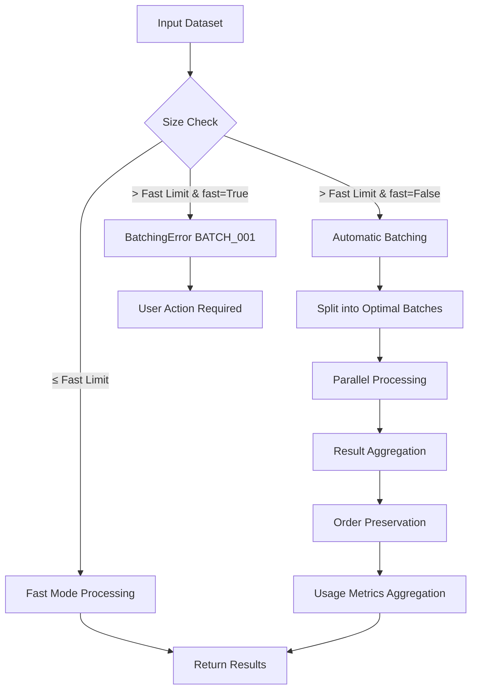

# Batching Guide

This guide covers the enhanced automatic batching capabilities in the Pulse SDK, designed to handle large-scale data processing efficiently while maintaining API compatibility and providing optimal performance.

## Overview

The Pulse SDK features comprehensive automatic batching that:

- **Handles large datasets transparently** - Process millions of texts without manual chunking
- **Maintains API compatibility** - Existing code works without modifications
- **Optimizes performance** - Parallel processing with intelligent resource management
- **Preserves data integrity** - Results maintain input order and structure
- **Provides robust error handling** - Clear error messages with actionable guidance

## Batching Architecture

### Processing Modes

The SDK supports two processing modes with different batching behaviors:

#### Fast Mode (`fast=True`)
- **Purpose**: Quick synchronous processing for small datasets
- **Limits**: 200 texts for most features
- **Behavior**: Direct API calls without batching
- **Use case**: Interactive applications, small datasets, quick testing

#### Slow Mode (`fast=False`)
- **Purpose**: Scalable processing for large datasets
- **Limits**: Up to 1,000,000 texts (varies by feature)
- **Behavior**: Automatic batching with parallel processing
- **Use case**: Batch processing, data analysis, large-scale operations

### Batching Strategy



## Feature-Specific Batching

### Sentiment Analysis

```python
from pulse.core.client import CoreClient

client = CoreClient.with_client_credentials()

# Small dataset - fast mode
small_texts = ["Great product!", "Not satisfied", "Excellent service"] * 50  # 150 texts
result = client.analyze_sentiment(small_texts, fast=True)

# Large dataset - automatic batching
large_texts = ["Customer feedback text"] * 50000  # 50k texts
result = client.analyze_sentiment(large_texts, fast=False)
# Automatically batched into 2,000-text chunks, processed in parallel
```

**Batching Details:**
- **Fast mode limit**: 200 texts
- **Slow mode limit**: 1,000,000 texts
- **Batch size**: 2,000 texts per batch
- **Concurrent jobs**: Up to 5 parallel batches
- **Processing time**: ~30 seconds per 1,000 texts

### Embeddings Generation

```python
from pulse.core.models import EmbeddingsRequest

# Large corpus embedding generation
corpus = ["Document text content"] * 100000  # 100k documents

request = EmbeddingsRequest(inputs=corpus, fast=False)
result = client.create_embeddings(request)

print(f"Generated {len(result.embeddings)} embeddings")
print(f"Vector dimension: {len(result.embeddings[0].vector)}")
```

**Batching Details:**
- **Fast mode limit**: 200 texts
- **Slow mode limit**: 1,000,000 texts
- **Batch size**: 5,000 texts per batch (larger due to efficiency)
- **Concurrent jobs**: Up to 5 parallel batches
- **Processing time**: ~60 seconds per 1,000 texts

### Element Extraction

```python
# Large-scale element extraction
reviews = ["Customer review content"] * 25000  # 25k reviews
dictionary = ["quality", "service", "price", "delivery", "support"]

result = client.extract_elements(
    inputs=reviews,
    dictionary=dictionary,
    type="named-entities",
    expand_dictionary=True,
    fast=False
)

print(f"Extraction matrix: {len(result.matrix)} x {len(result.columns)}")
```

**Batching Details:**
- **Fast mode limit**: 200 texts
- **Slow mode limit**: 1,000,000 texts
- **Batch size**: 2,000 texts per batch
- **Concurrent jobs**: Up to 5 parallel batches
- **Processing time**: ~45 seconds per 1,000 texts

### Clustering

```python
# Large document clustering
documents = ["Research paper abstract"] * 5000  # 5k documents

result = client.cluster_texts(
    inputs=documents,
    k=20,
    algorithm="kmeans"
)

print(f"Created {len(result.clusters)} clusters")
for i, cluster in enumerate(result.clusters):
    print(f"Cluster {i}: {len(cluster.items)} documents")
```

**Batching Details:**
- **Auto-batch threshold**: 500 texts
- **Maximum limit**: 44,721 texts
- **Batching strategy**: Intelligent matrix-based processing
- **Concurrent jobs**: Up to 5 parallel operations
- **Processing time**: ~120 seconds per 1,000 texts

## Configuration and Optimization

### Basic Configuration

```python
from pulse.core.concurrent import BatchingConfig

# Conservative configuration for resource-constrained systems
conservative_config = BatchingConfig(
    max_concurrent_jobs=2,
    timeout_per_batch=600.0,
    default_batch_sizes={
        'sentiment': 1000,
        'embeddings': 2000,
        'extractions': 1000
    }
)

client = CoreClient.with_client_credentials(batching_config=conservative_config)
```

### Performance-Optimized Configuration

```python
# High-performance configuration for powerful systems
performance_config = BatchingConfig(
    max_concurrent_jobs=5,
    timeout_per_batch=300.0,
    default_batch_sizes={
        'sentiment': 2000,
        'embeddings': 5000,
        'extractions': 2000
    },
    retry_failed_batches=True,
    max_retries=3
)

client = CoreClient.with_client_credentials(batching_config=performance_config)
```

### Adaptive Configuration

```python
import psutil

def get_adaptive_config():
    """Generate configuration based on system resources."""

    memory_gb = psutil.virtual_memory().total / (1024**3)
    cpu_count = psutil.cpu_count()

    if memory_gb < 8:
        # Low memory system
        return BatchingConfig(
            max_concurrent_jobs=2,
            default_batch_sizes={'sentiment': 1000, 'embeddings': 2000}
        )
    elif memory_gb < 16:
        # Medium memory system
        return BatchingConfig(
            max_concurrent_jobs=3,
            default_batch_sizes={'sentiment': 1500, 'embeddings': 3000}
        )
    else:
        # High memory system
        return BatchingConfig(
            max_concurrent_jobs=5,
            default_batch_sizes={'sentiment': 2000, 'embeddings': 5000}
        )

# Use adaptive configuration
config = get_adaptive_config()
client = CoreClient.with_client_credentials(batching_config=config)
```

## Performance Optimization

### Batch Size Optimization

```python
def calculate_optimal_batch_size(total_texts, feature="sentiment", target_time=300):
    """Calculate optimal batch size based on target processing time."""

    # Processing rates (texts per second)
    rates = {
        'sentiment': 33,    # ~33 texts/second
        'embeddings': 17,   # ~17 texts/second
        'extractions': 22   # ~22 texts/second
    }

    rate = rates.get(feature, 20)
    optimal_size = int(rate * target_time)  # texts processable in target_time

    # Apply reasonable bounds
    min_size = 500
    max_sizes = {'sentiment': 2000, 'embeddings': 5000, 'extractions': 2000}
    max_size = max_sizes.get(feature, 2000)

    return max(min_size, min(optimal_size, max_size))

# Configure with optimal batch sizes
optimal_sentiment = calculate_optimal_batch_size(100000, "sentiment", 300)
optimal_embeddings = calculate_optimal_batch_size(100000, "embeddings", 600)

config = BatchingConfig(
    default_batch_sizes={
        'sentiment': optimal_sentiment,
        'embeddings': optimal_embeddings
    }
)
```

### Memory Management

```python
import gc
from contextlib import contextmanager

@contextmanager
def memory_managed_processing():
    """Context manager for memory-efficient batch processing."""

    # Force garbage collection before processing
    gc.collect()

    initial_memory = psutil.virtual_memory().percent
    print(f"Initial memory usage: {initial_memory:.1f}%")

    try:
        yield
    finally:
        # Clean up after processing
        gc.collect()

        final_memory = psutil.virtual_memory().percent
        print(f"Final memory usage: {final_memory:.1f}%")
        print(f"Memory change: {final_memory - initial_memory:+.1f}%")

# Use memory management for large operations
with memory_managed_processing():
    large_dataset = ["text"] * 200000
    result = client.analyze_sentiment(large_dataset, fast=False)
```

### Concurrent Processing Optimization

```python
def optimize_concurrency_for_dataset(dataset_size, feature="sentiment"):
    """Optimize concurrency based on dataset size and feature."""

    if dataset_size < 10000:
        # Small dataset - use higher concurrency for speed
        return 5
    elif dataset_size < 100000:
        # Medium dataset - balanced approach
        return 3
    else:
        # Large dataset - conservative concurrency to manage resources
        return 2

# Apply optimized concurrency
dataset = ["text"] * 150000
optimal_concurrency = optimize_concurrency_for_dataset(len(dataset), "sentiment")

config = BatchingConfig(max_concurrent_jobs=optimal_concurrency)
client = CoreClient.with_client_credentials(batching_config=config)

result = client.analyze_sentiment(dataset, fast=False)
```

## Monitoring and Debugging

### Progress Monitoring

```python
import time
from tqdm import tqdm

class BatchingProgressMonitor:
    def __init__(self, total_texts, feature="sentiment"):
        self.total_texts = total_texts
        self.feature = feature
        self.start_time = None

    def estimate_batches(self, batch_size=2000):
        return (self.total_texts + batch_size - 1) // batch_size

    def estimate_time(self, batch_size=2000, time_per_batch=60):
        num_batches = self.estimate_batches(batch_size)
        concurrent_jobs = min(5, num_batches)
        return (num_batches / concurrent_jobs) * time_per_batch

    def start_monitoring(self):
        self.start_time = time.time()
        estimated_batches = self.estimate_batches()
        estimated_time = self.estimate_time()

        print(f"Starting {self.feature} processing:")
        print(f"  Total texts: {self.total_texts:,}")
        print(f"  Estimated batches: {estimated_batches}")
        print(f"  Estimated time: {estimated_time:.0f} seconds")

        return tqdm(total=self.total_texts, desc=f"Processing {self.feature}")

    def finish_monitoring(self, progress_bar):
        if self.start_time:
            elapsed = time.time() - self.start_time
            rate = self.total_texts / elapsed

            progress_bar.close()
            print(f"Processing completed:")
            print(f"  Total time: {elapsed:.1f} seconds")
            print(f"  Processing rate: {rate:.1f} texts/second")

# Use progress monitoring
texts = ["sample text"] * 75000
monitor = BatchingProgressMonitor(len(texts), "sentiment")

progress = monitor.start_monitoring()
result = client.analyze_sentiment(texts, fast=False)
progress.update(len(texts))
monitor.finish_monitoring(progress)
```

### Resource Usage Monitoring

```python
import psutil
import threading
import time

class ResourceMonitor:
    def __init__(self, interval=5):
        self.interval = interval
        self.monitoring = False
        self.samples = []

    def start_monitoring(self):
        self.monitoring = True
        self.samples = []

        monitor_thread = threading.Thread(target=self._monitor_loop)
        monitor_thread.daemon = True
        monitor_thread.start()

    def stop_monitoring(self):
        self.monitoring = False

    def _monitor_loop(self):
        while self.monitoring:
            sample = {
                'timestamp': time.time(),
                'memory_percent': psutil.virtual_memory().percent,
                'cpu_percent': psutil.cpu_percent(),
                'network_io': psutil.net_io_counters()._asdict()
            }
            self.samples.append(sample)
            time.sleep(self.interval)

    def get_summary(self):
        if not self.samples:
            return "No monitoring data available"

        memory_values = [s['memory_percent'] for s in self.samples]
        cpu_values = [s['cpu_percent'] for s in self.samples]

        return {
            'duration': self.samples[-1]['timestamp'] - self.samples[0]['timestamp'],
            'memory_avg': sum(memory_values) / len(memory_values),
            'memory_max': max(memory_values),
            'cpu_avg': sum(cpu_values) / len(cpu_values),
            'cpu_max': max(cpu_values),
            'samples_count': len(self.samples)
        }

# Monitor resource usage during processing
monitor = ResourceMonitor(interval=10)
monitor.start_monitoring()

# Process large dataset
large_texts = ["document content"] * 100000
result = client.analyze_sentiment(large_texts, fast=False)

monitor.stop_monitoring()
summary = monitor.get_summary()

print(f"Resource usage summary:")
print(f"  Duration: {summary['duration']:.1f} seconds")
print(f"  Average memory: {summary['memory_avg']:.1f}%")
print(f"  Peak memory: {summary['memory_max']:.1f}%")
print(f"  Average CPU: {summary['cpu_avg']:.1f}%")
print(f"  Peak CPU: {summary['cpu_max']:.1f}%")
```

## Best Practices

### 1. Choose the Right Processing Mode

```python
def choose_processing_mode(dataset_size, urgency="normal"):
    """Choose optimal processing mode based on dataset size and urgency."""

    if dataset_size <= 200:
        return True  # Fast mode for small datasets
    elif urgency == "high" and dataset_size <= 1000:
        # Manual chunking for urgent medium datasets
        return "manual_chunking"
    else:
        return False  # Slow mode with automatic batching

# Apply processing mode selection
texts = ["customer feedback"] * 5000
mode = choose_processing_mode(len(texts), urgency="normal")

if mode is True:
    result = client.analyze_sentiment(texts, fast=True)
elif mode is False:
    result = client.analyze_sentiment(texts, fast=False)
elif mode == "manual_chunking":
    # Manual chunking for urgent processing
    results = []
    for i in range(0, len(texts), 200):
        chunk = texts[i:i+200]
        chunk_result = client.analyze_sentiment(chunk, fast=True)
        results.extend(chunk_result.results)
```

### 2. Validate Input Before Processing

```python
def validate_dataset(texts, feature="sentiment"):
    """Validate dataset before processing to prevent errors."""

    issues = []

    # Basic validation
    if not texts:
        issues.append("Empty dataset")
        return issues

    # Size validation
    limits = {
        'sentiment': 1_000_000,
        'embeddings': 1_000_000,
        'extractions': 1_000_000,
        'clustering': 44_721
    }

    limit = limits.get(feature, 1_000_000)
    if len(texts) > limit:
        issues.append(f"Dataset too large: {len(texts)} > {limit}")

    # Content validation
    empty_texts = sum(1 for text in texts if not text.strip())
    if empty_texts > 0:
        issues.append(f"Found {empty_texts} empty texts")

    very_long_texts = sum(1 for text in texts if len(text) > 10000)
    if very_long_texts > 0:
        issues.append(f"Found {very_long_texts} very long texts (>10k chars)")

    return issues

# Validate before processing
texts = ["sample text"] * 50000
issues = validate_dataset(texts, "sentiment")

if issues:
    print("Dataset validation issues:")
    for issue in issues:
        print(f"  ⚠️  {issue}")

    # Handle issues or proceed with caution
    if "Dataset too large" in str(issues):
        # Split dataset
        chunk_size = 1_000_000
        for i in range(0, len(texts), chunk_size):
            chunk = texts[i:i+chunk_size]
            result = client.analyze_sentiment(chunk, fast=False)
else:
    print("✅ Dataset validation passed")
    result = client.analyze_sentiment(texts, fast=False)
```

### 3. Implement Robust Error Handling

```python
from pulse.core.exceptions import BatchingError
import time

def robust_batch_processing(texts, feature="sentiment", max_retries=3):
    """Robust processing with comprehensive error handling."""

    for attempt in range(max_retries):
        try:
            if feature == "sentiment":
                return client.analyze_sentiment(texts, fast=False)
            elif feature == "embeddings":
                from pulse.core.models import EmbeddingsRequest
                request = EmbeddingsRequest(inputs=texts, fast=False)
                return client.create_embeddings(request)

        except BatchingError as e:
            print(f"Batching error on attempt {attempt + 1}: {e.error_code}")

            if e.error_code == "BATCH_001":  # Fast mode limit
                print("Switching to slow mode")
                continue

            elif e.error_code == "BATCH_002":  # Slow mode limit
                print("Dataset too large, splitting")
                # Split and process in chunks
                chunk_size = e.limit
                results = []
                for i in range(0, len(texts), chunk_size):
                    chunk = texts[i:i+chunk_size]
                    chunk_result = robust_batch_processing(chunk, feature, 1)
                    if feature == "sentiment":
                        results.extend(chunk_result.results)
                    elif feature == "embeddings":
                        results.extend(chunk_result.embeddings)
                return type(chunk_result)(results)

            elif e.error_code in ["BATCH_003", "BATCH_006", "BATCH_007"]:
                # Retryable errors
                if attempt < max_retries - 1:
                    wait_time = 30 * (attempt + 1)
                    print(f"Retrying in {wait_time} seconds...")
                    time.sleep(wait_time)
                    continue

            raise  # Re-raise if not handled

        except Exception as e:
            print(f"Unexpected error on attempt {attempt + 1}: {e}")
            if attempt == max_retries - 1:
                raise
            time.sleep(10)

    raise Exception(f"All {max_retries} attempts failed")

# Use robust processing
texts = ["customer review"] * 75000
try:
    result = robust_batch_processing(texts, "sentiment")
    print(f"Successfully processed {len(result.results)} texts")
except Exception as e:
    print(f"Processing failed: {e}")
```

## Troubleshooting

For detailed troubleshooting guidance, see the [Batching Error Reference](batching-errors.md).

### Common Issues and Solutions

1. **Fast mode limit exceeded (BATCH_001)**
   - Solution: Switch to slow mode (`fast=False`)
   - Alternative: Manual chunking with fast mode

2. **Slow mode limit exceeded (BATCH_002)**
   - Solution: Split dataset into smaller chunks
   - Alternative: Data sampling or filtering

3. **Batch processing failures (BATCH_003)**
   - Solution: Retry with smaller batch sizes
   - Alternative: Check network connectivity and data quality

4. **Resource exhaustion (BATCH_007)**
   - Solution: Reduce concurrent jobs and batch sizes
   - Alternative: Monitor system resources and optimize

5. **Timeout errors (BATCH_006)**
   - Solution: Increase timeout or reduce batch sizes
   - Alternative: Check API performance and network

### Performance Troubleshooting

```python
def diagnose_performance_issues(texts, feature="sentiment"):
    """Diagnose potential performance issues with dataset."""

    print(f"Performance diagnosis for {feature}:")
    print(f"  Dataset size: {len(texts):,} texts")

    # Check text characteristics
    text_lengths = [len(text) for text in texts[:1000]]  # Sample first 1000
    avg_length = sum(text_lengths) / len(text_lengths)
    max_length = max(text_lengths)

    print(f"  Average text length: {avg_length:.0f} characters")
    print(f"  Maximum text length: {max_length:,} characters")

    # Estimate processing time
    rates = {'sentiment': 33, 'embeddings': 17, 'extractions': 22}
    rate = rates.get(feature, 20)
    estimated_time = len(texts) / rate

    print(f"  Estimated processing time: {estimated_time:.0f} seconds")

    # Check system resources
    memory_percent = psutil.virtual_memory().percent
    cpu_count = psutil.cpu_count()

    print(f"  Current memory usage: {memory_percent:.1f}%")
    print(f"  Available CPU cores: {cpu_count}")

    # Recommendations
    recommendations = []

    if len(texts) > 100000:
        recommendations.append("Consider processing in smaller chunks for better progress tracking")

    if avg_length > 5000:
        recommendations.append("Long texts detected - consider increasing timeout")

    if memory_percent > 80:
        recommendations.append("High memory usage - reduce concurrent jobs")

    if estimated_time > 1800:  # 30 minutes
        recommendations.append("Long processing time expected - consider data sampling")

    if recommendations:
        print("  Recommendations:")
        for rec in recommendations:
            print(f"    • {rec}")
    else:
        print("  ✅ No performance issues detected")

# Diagnose before processing
texts = ["document content"] * 200000
diagnose_performance_issues(texts, "sentiment")
```

This comprehensive batching guide provides everything you need to effectively use the Pulse SDK's automatic batching capabilities for large-scale text processing operations.
