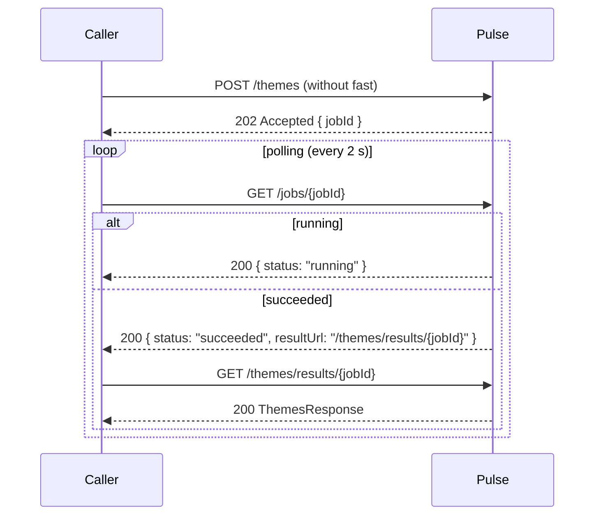

# **Pulse Python Client — Design Specification**

_Revision 6 — April 2025_

---

## **1 Goals**

- Deliver an **idiomatic, type‑safe** Python interface to the Pulse REST API.
- Expose **two abstraction layers**: a thin 1‑to‑1 **CoreClient** and a higher‑level **Analyzer** that coordinates common workflows.
- Provide **first‑class interop** with **pandas**, **NumPy**, and **scikit‑learn**.
- Support **on‑disk caching** so repeatable scripts avoid unnecessary API calls.
- Optimise for **Jupyter** usage and pave the way for a **public PyPI** release.

---

## **2 Pulse API Overview (v0.3.2 \+ roadmap)**
- **Request Bodies:**
  - `/embeddings`: `{ "input": [<strings>] }`
  - `/similarity`: `{ "set": [<strings>] }` (self) or `{ "set_a": [<strings>], "set_b": [<strings>] }` (cross)
  - `/themes`: `{ "inputs": [<strings>] }`
  - `/sentiment`: `{ "input": [<strings>] }`

| Endpoint      | Method | Purpose                                          | Notes                                                       |
| ------------- | ------ | ------------------------------------------------ | ----------------------------------------------------------- |
| `/embeddings` | POST   | Generate dense vector embeddings (≤ 200 strings) | Accepts `{"fast": true}` for sync; otherwise returns a job. |
| `/similarity` | POST   | Compute cosine similarity (self / cross)         | Same fast / job behaviour; keeps `flatten` query.           |
| `/themes`     | POST   | Cluster texts into latent themes                 | Same fast / job behaviour.                                  |
| `/sentiment`  | POST   | Classify sentiment                               | Same fast / job behaviour.                                  |
| `/jobs/{id}`  | GET    | Poll job status                                  | Canonical async tracking endpoint.                          |

- **Dev base URL** `https://dev.core.researchwiseai.com/pulse/v1`
- **Prod base URL** `https://core.researchwiseai.com/pulse/v1`
- **Auth today** None (private network).
- **Auth roadmap** OAuth 2 client‑credentials (Auth0).
- **Batch limit** 200 strings per request.
- **Rate limits** TBD.

### **2.1 Jobs Flow _(planned)_**



---

## **3 Package Layout**

```plaintext
pulse_client/
├── auth.py                # OAuth2Credentials (future)
├── config.py              # base URL, timeouts, retries
├── core/
│   ├── client.py          # CoreClient / CoreAsyncClient
│   ├── jobs.py            # Job model + polling helpers
│   ├── models.py          # Pydantic representations
│   └── exceptions.py      # Error hierarchy
└── analysis/
    ├── analyzer.py        # High‑level orchestrator
    └── processes.py       # Built‑in Process subclasses
```

---

## **4 Core (Low‑Level) API**

### **4.1 Auth Strategy**

```python
client = CoreClient()  # no auth today

client = CoreClient.with_client_credentials(
    domain="auth.researchwiseai.com",
    client_id="…",
    client_secret="…",
)  # future
```

### **4.2 Fast vs Job Behaviour**

| Method                 | `fast=True` (default sync)     | `fast=False` / omitted                            |
| :--------------------- | :----------------------------- | :------------------------------------------------ |
| `create_embeddings()`  | Returns **EmbeddingsResponse** | Returns **Job**, `wait()` blocks with 2 s polling |
| `compare_similarity()` | Returns **SimilarityResponse** | Returns **Job**                                   |
| `generate_themes()`    | Returns **ThemesResponse**     | Returns **Job**                                   |
| `analyze_sentiment()`  | Returns **SentimentResponse**  | Returns **Job**                                   |

### **4.3 Job Model**

```python
class Job(BaseModel):
    id: str
    status: Literal["queued", "running", "succeeded", "failed"]
    result_url: str | None = None

    def refresh(self) -> "Job": ...           # one HTTP GET
    def wait(self, timeout: float = 60) -> Any:  # polls /jobs every 2 seconds
        """Block until the job finishes or the timeout is hit."""
```

---

## **5 High‑Level API (Analyzer & Processes)**

### **5.1 Process Primitives**

```python
class Process(Protocol):
    id: str                                 # e.g. "theme-generation"
    depends_on: tuple[str, ...] = ()
    def run(self, ctx: "Context") -> Any: ...
```

| Process             | Options                                          | Depends on        |
| :------------------ | :----------------------------------------------- | :---------------- |
| **ThemeGeneration** | `min_themes`, `max_themes`, `context`, `fast`    | —                 |
| **ThemeAllocation** | `themes` (optional), `single_label`, `threshold` | ThemeGeneration\* |
| **Sentiment**       | `fast`                                           | —                 |
| **Cluster**         | `fast`                                           | —                 |

_ThemeAllocation_ bypasses its dependency if `themes` are supplied.
_Cluster_ caches the similarity matrix once; users can later run **K‑Means** or **DBSCAN** (via scikit‑learn) without re‑contacting the API.

### **5.2 Analyzer Class**

```python
az = Analyzer(
    dataset=inputs,          # list[str] | pd.Series
    processes=[ThemeAllocation(), Sentiment()],
    fast=True,               # default for all processes
    cache_dir=".pulse_cache" # on‑disk cache
)

results = az.run()
print(results.sentiment.summary())
print(results.theme_allocation.to_dataframe())
```

Constructor (abridged):

```python
def __init__(
    self,
    dataset: Sequence[str] | pd.Series,
    processes: Sequence[Process] | None = None,
    *,
    fast: bool | None = None,
    cache_dir: str | Path | None = None,
    client: CoreClient | None = None,
    auth: OAuth2Credentials | None = None,
): ...
```

### **5.3 Result Objects**

| Process         | Result class            | Key helpers                                                                            |
| :-------------- | :---------------------- | :------------------------------------------------------------------------------------- |
| ThemeGeneration | `ThemeGenerationResult` | `.themes`, `.to_dataframe()`                                                           |
| ThemeAllocation | `ThemeAllocationResult` | `.assign_single(threshold)`, `.assign_multi(k)`, `.heatmap()`                          |
| Sentiment       | `SentimentResult`       | `.summary()`, `.to_dataframe()`, `.plot_distribution()`                                |
| Cluster         | `ClusterResult`         | `.kmeans(n_clusters)`, `.dbscan(eps, min_samples)`, `.plot_scatter()`, `.dendrogram()` |

`AnalysisResult.__getattr__` exposes these dynamically and raises `AttributeError` if the corresponding process was not requested.

### **5.4 Execution Flow & Caching**

1. **Dependency resolution** – topological sort, auto‑inserts missing prereqs.
2. **Execution** – sequential or concurrent (`asyncio`) respecting dependencies.
3. **Caching** – each process result is memoised in memory and optionally persisted to `cache_dir` keyed by a hash of _dataset \+ process config_.
4. **Error handling** – failures raise typed exceptions; `continue_on_error=True` is available for best‑effort runs.

### **5.5 Extensibility**

Third‑party packages can register new processes via entry‑points or direct subclassing.

---

## **6 Command‑Line Interface**

```python
$ pip install pulse-client

# Fast, synchronous request
$ pulse themes --input responses.txt --fast

# Async job with progress display
$ pulse themes --input responses.txt --slow
```

---

## **7 Developer Experience Highlights**

- **pandas / NumPy** everywhere (`.to_dataframe()`, `.to_numpy()`).
- Built‑in **scikit‑learn** clustering (`kmeans`, `dbscan`).
- Rich representations in Jupyter (`_repr_html_`).
- Strict typing via `pydantic v2` and `py.typed` marker.
- Code‑style & CI: `black`, `ruff`, `pytest`, GitHub Actions.

---

## **8 Dependencies**

| Package             | Purpose                              |
| :------------------ | :----------------------------------- |
| `httpx`             | HTTP transport \+ connection pooling |
| `pydantic`          | Typed models                         |
| `numpy`, `pandas`   | Core data manipulation               |
| `scikit‑learn>=1.4` | K‑Means, DBSCAN, etc.                |
| `diskcache`         | Optional on‑disk caching             |
| `tqdm`              | Progress bars (optional feature)     |
| `typing‑extensions` | Back‑ports for older Python versions |

---

## **9 Suggested Backend API Improvements**

1. **Standard Job schema** (`/jobs/{id}`) using RFC 7807 problem‑detail format.
2. **Consistent async protocol** – all long operations support `fast`; default to async.
3. **Completed‑job response** – always `200 OK` JSON with `resultUrl` (no redirects).
4. **Rate‑limit headers** – `Retry‑After`, `X‑RateLimit‑*`.
5. **OpenAPI examples** – richer autogenerated docs.
6. **Health endpoint** – `GET /healthz`.
7. **Versioned base path** – keep `/pulse/v1` stable; future breaking changes use `/v2`.
8. **CORS / pre‑flight support** for browser clients.

---

## **10 Implementation Roadmap**

| Milestone | Deliverable                                     |
| :-------- | :---------------------------------------------- |
| **0.1.0** | Sync CoreClient, Job model, fixed 2‑s polling   |
| **0.2.0** | Async client, OAuth2 flow, retry/back‑off       |
| **0.3.0** | Analyzer \+ built‑in processes, on‑disk caching |
| **0.4.0** | CLI, docs site, publish to PyPI                 |

---

## **11 Open Questions**

1. Confirm **rate‑limit policy** and exact header names.
2. Will _all_ future long‑running endpoints follow the proposed job schema?
3. Desired **error taxonomy** (HTTP ↔ exception classes).
4. Any additional high‑level workflows to prioritise?
